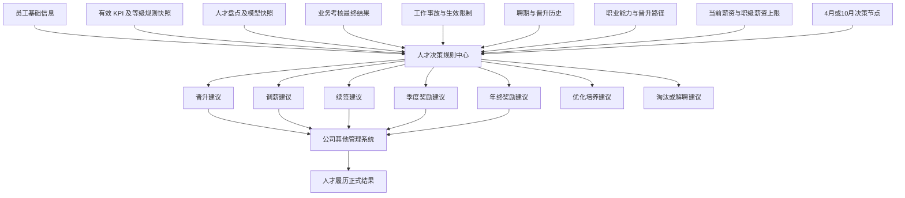

# 人才发展综合决策规则设计与开发交接

> 交接日期：2026-08-12  
> 适用项目：产品部管理工作台（`depot-KPI`）  
> 当前分支：`depot-KPI`  
> 当前基线提交：`4743f69 Merge branch 'main' into depot-KPI`  
> 交接性质：本轮业务规则确认、当前代码差距盘点及后续开发实施方案  
> 重要说明：本文是对 [2026-08-10 人才发展模块代码开发交接](./2026-08-10-人才发展模块代码开发交接.md) 的增量交接，不覆盖原交接记录。

## 一、交接结论

人才发展模块已经具备人才盘点、业务考核、工作事故、员工档案、部门建议和正式履历等第一轮真实能力，但现有“人才决策”实现仍属于证据汇总与人工建议，尚未形成符合部门绩效管理机制的综合规则引擎。

本轮确认的核心结论如下：

1. 人才决策规则必须独立于工作事故规则，统一读取 KPI、人才盘点、业务考核、工作事故、聘期、晋升历史、职业能力模型和薪资上限。
2. 晋升和调薪采用相同的固定决策节点：每年 4 月和 10 月；考察期不是自然半年，而是围绕节点向前核算半年。
3. 4 月节点考察上年 10 月 1 日至当年 3 月 31 日，10 月节点考察当年 4 月 1 日至 9 月 30 日。
4. 晋升与调薪共用同一个半年数据快照，但必须分别计算资格、分别形成建议，允许出现“建议晋升但暂不调薪”等组合结果。
5. KPI 分数等级区间必须配置化、版本化，不能在代码中写死 S/A/B/C/D 的分数范围。
6. KPI 和人才盘点对晋升、调薪的影响按对应决策节点的半年考察期计算，不能简单读取数据库中的“最新一条”。
7. 业务考核不合格是晋升和调薪的约束条件；尚无结果或缺考属于资料不完整，不能自动判定通过。
8. 奖励必须拆成“季度奖励”和“年终奖励”两个独立决策类型、限制类型和正式履历类型。
9. 工作事故产生的限制必须拆成可量化记录：限制事项、开始日期、结束日期、来源事故和当前状态，不能只保存一段说明文字。
10. 部门决策建议与公司正式结果继续独立管理；建议不等于正式晋升、续签、调薪或奖励记录。
11. 所有用户页面、配置表单和导入模板均不得要求用户填写业务编码或内部 ID；编码由系统自动生成，用户只操作业务名称和选项。

## 二、设计依据与已确认边界

### 2.1 制度与既有设计

- 部门绩效管理机制：  
  <https://alidocs.dingtalk.com/i/nodes/3xRN9bGQyw4Jb5YggPEBVzXPADKnorv6>
- [人才发展模块设计方案](../../人才发展模块设计方案.md)
- [人才发展模块第0轮基线与详细设计](../../人才发展模块第0轮基线与详细设计.md)
- [2026-08-10 人才发展模块代码开发交接](./2026-08-10-人才发展模块代码开发交接.md)

本轮规则依据用户提供的部门绩效管理机制重点截图和逐项确认结论整理。当前环境的钉钉文档读取能力因未登录未能取回全文；正式开发前应再次读取制度原文，重点复核本文第十四节列出的待确认口径，但不得因此推翻本轮已经明确确认的规则。

### 2.2 系统职责边界

- 本系统计算资格、识别限制、展示证据并形成部门建议。
- 公司正式审批仍在其他管理系统完成。
- 公司最终结果回填人才履历，作为后续决策的正式事实来源。
- 人才盘点评价员工当前状态；职业能力模型定义岗位职级和晋升标准，两套模型独立配置、在决策层聚合。
- KPI 页面实时读取业务考核和工作事故扣分提醒，不覆盖主管评分和其他扣分事项。

## 三、综合人才决策总体架构



### 3.1 决策类型

目标决策类型至少包括：

| 决策类型 | 典型输出 |
| --- | --- |
| 晋升 | 符合、条件不完整、不符合、限制至某日 |
| 续签 | 建议续签、不建议续签、直接解聘 |
| 调薪 | 符合、不符合、限制至某日、建议幅度 |
| 季度奖励 | 可参与、取消单项奖、取消季度奖、全部取消 |
| 年终奖励 | 可参与、不建议、取消年终奖 |
| 优化培养 | 正常、进入优化池、培训、转岗、能力复核 |
| 淘汰解聘 | 无、建议解聘、直接解聘 |

### 3.2 规则执行优先级

同一员工同时命中多条规则时，按以下顺序执行：

1. 直接解聘。
2. 不续签。
3. 决策事项限期禁止。
4. 资格条件不满足或资料不完整。
5. 进入优化池或培养计划。
6. 正常形成晋升、调薪或奖励建议。

多条同类限制不得互相覆盖，应保留全部来源并以最晚结束日期作为实际限制截止日。

## 四、晋升与调薪的统一决策节点

### 4.1 固定节点和考察期

| 决策节点 | 半年考察期 | 纳入 KPI |
| --- | --- | --- |
| 每年 4 月 | 上年 10 月 1 日至当年 3 月 31 日 | 上年 Q4、当年 Q1 |
| 每年 10 月 | 当年 4 月 1 日至 9 月 30 日 | 当年 Q2、当年 Q3 |

系统应按节点生成统一决策批次，例如：

- `2026年4月晋升与调薪评估`
- `2026年10月晋升与调薪评估`

节点日建议可配置为 4 月 1 日和 10 月 1 日；考察期边界必须由系统根据节点自动计算，用户无需填写。

### 4.2 数据归属口径

- KPI：按 KPI 所属季度归属，不按终审操作日期归属。
- 人才盘点：按盘点批次对应的半年周期归属。
- 业务考核：按业务考核批次季度归属，不按文件导入日期归属。
- 工作事故：按事故确认生效日期归属；跨期限制还需判断节点当天是否仍有效。
- 职业能力：读取节点截止日前最近一次已发布、适用于当前岗位和目标职级的能力评估。
- 晋升、调薪、薪资和聘期：读取考察截止日前已经生效的正式人才履历。

### 4.3 半年表现与跨期限制必须分开计算

半年表现只检查当前考察期内的 KPI、人才盘点、业务考核和事故事实；跨期限制则不论来源是否发生在本半年，只要节点当天仍未到期就继续生效。

例如 2026 年 1 月确认 A 级事故并限制晋升、调薪 12 个月：

- 2026 年 4 月节点：受限。
- 2026 年 10 月节点：仍受限。
- 2027 年 4 月节点：限制已到期，可以重新评估。

## 五、KPI 等级规则配置

### 5.1 配置要求

KPI 分数区间不得写死，应新增版本化“绩效等级规则”。默认初始值为：

| 等级 | 最低分 | 最高分 | 评价 |
| --- | ---: | ---: | --- |
| S | 110 | 不设上限 | 绩效优秀 |
| A | 100 | 109 | 绩效良好 |
| B | 90 | 99 | 基本满意 |
| C | 70 | 89 | 尚需改进 |
| D | 0 | 69 | 不达预期 |

页面采用一行一个等级，支持一次性维护和保存：

- 等级业务名称。
- 最低分。
- 最高分或“不设上限”。
- 评价说明。
- 新增、删除和调整顺序。

页面不得出现规则编码输入框；内部标识和排序由系统生成。

### 5.2 保存校验

- 区间不能重叠。
- 区间不能断档。
- 最低分不能高于最高分。
- 只能有一个“不设上限”的最高等级。
- 同一版本中的等级名称不能重复。
- 已发布版本不得直接覆盖，应复制为新版本。

### 5.3 等级快照

KPI 终审时保存分数、等级和所用等级规则版本。历史结果默认不随新版本改变；如确需用新规则适配历史成绩，必须由用户明确执行“按新规则重新计算”，保留原结果、调整后结果、操作人、时间和原因。

### 5.4 部门分布校验

根据部门绩效管理机制，KPI 终审还需支持配置部门分布校验，例如：

- 除主管外，人数达到 5 人及以上的部门，员工之间 KPI 分差至少 10 分。
- 低于 100 分的员工占比不得低于 10%。

该规则属于 KPI 终审校验，不直接生成员工人才决策；人才决策只消费经过终审的有效 KPI。

## 六、晋升规则

### 6.1 晋升资格公式

```text
晋升资格
= 节点当天无生效中的晋升限制
+ 本决策半年两个季度 KPI 达到配置要求
+ 本决策半年人才盘点达到配置要求
+ 本决策半年全部应参加业务考核合格
+ 职业能力模型达到目标职级要求
+ 晋升路径允许进入目标细分职级
+ 聘期及岗位条件满足
+ 晋升后薪资不超过目标职级薪资上限
```

### 6.2 KPI 半年条件

不得读取“最近有效 KPI”，必须读取决策半年内的两个季度。规则支持配置以下判断方式：

- 两个季度均达到指定等级。
- 半年内最低等级达到指定等级。
- 半年平均分达到指定分数。
- 允许最多一个季度低于指定等级。

建议默认：两个季度均达到 B 级及以上。任一季度尚未终审时，结果为“资料不完整”，不得自动判定通过。

### 6.3 人才盘点半年条件

不得读取“最近人才盘点”，必须读取本决策半年对应的盘点结果。建议默认：本期盘点达到 B 级及以上，且未触发 C/D 限制。

- C 级：进入整改或优化期，并按照规则生成晋升限制。
- D 级：触发淘汰或解聘规则。
- 本期无有效盘点：资料不完整，不得自动判定晋升通过。

### 6.4 业务考核条件

本决策半年内所有应参加的业务考核必须有最终结果且全部合格：

- 首次及格：合格。
- 补考及格：合格，同时保留补考事实。
- 补考不及格：不合格。
- 缺考：不合格。
- 尚无结果：资料不完整。

规则应支持配置是否接受补考及格、是否只检查指定必修科目等业务条件。

### 6.5 职业能力和薪资上限

- 当前岗位对应的职业能力模型必须达到目标职级。
- 晋升路径必须允许从当前细分职级进入目标细分职级。
- 调整后薪资不得突破目标职级薪资上限。
- 能力不达标属于“资格不满足”，事故限制属于“限期禁止”，页面要分别展示。

## 七、调薪规则

调薪与晋升使用相同的 4 月、10 月节点和半年考察期，但必须独立计算资格。

### 7.1 调薪类型

1. 晋升调薪：晋升已通过，按目标职级核算薪资上限。
2. 非晋升调薪：职级不变，按当前职级核算薪资上限。

### 7.2 非晋升调薪资格

```text
非晋升调薪资格
= 节点当天无生效中的调薪限制
+ 本决策半年两个季度 KPI 达到配置要求
+ 本决策半年人才盘点达到配置要求
+ 本决策半年全部应参加业务考核合格
+ 调整后薪资不超过当前职级薪资上限
```

### 7.3 晋升调薪资格

```text
晋升调薪资格
= 晋升正式或部门决策已经通过
+ 节点当天无生效中的调薪限制
+ 调整后薪资不超过目标职级薪资上限
```

### 7.4 调薪幅度配置

调薪规则应支持：

- 固定金额。
- 调薪百分比。
- 金额或比例上限。
- 不同 KPI 等级与人才盘点等级对应的建议区间。
- 当前或目标职级薪资上限。

建议幅度只形成部门建议，正式调薪金额以人才履历回填为准。

## 八、业务考核规则

### 8.1 已确认规则

- 按季度建立业务考核规则和业务考核批次。
- 业务考核总分当前为 6 分，但应由规则版本配置。
- 科目按规则平均摊分。
- 首次及格、补考及格、补考不及格分别填写得分百分比，默认 100%、50%、0%。
- 每个科目独立配置分数评分或等级评分。
- 科目配置完成后，按小组设置及格分数或要求等级；个人规则只作为同科目的特殊覆盖。
- 只保存最终结果，不保存考试过程。
- 考试时间段属于整个考核批次，不属于单个员工成绩。
- 用户和导入模板均不填写科目编码，以科目名称匹配，内部编码由系统生成。

### 8.2 对晋升和调薪的约束

决策引擎必须检查当前半年内两个季度的全部应考结果，而不是只读最新一个 `BusinessAssessmentSummary`。规则优先级建议为：个人规则 > 小组规则 > 科目默认规则。

## 九、人才盘点、聘期、优化和解聘规则

### 9.1 首个聘期

| 触发条件 | 决策结果 |
| --- | --- |
| 入职后第 3 次人才盘点为 C 级及以下 | 直接解聘 |
| 第 3、4、5 次盘点中出现 2 次 C | 不续签 |
| 第 3、4、5 次盘点中连续 2 次 C | 直接解聘 |
| 第 5 次盘点为 C | 不续签 |
| 人才盘点为 C | 进入优化池 |
| 人才盘点为 D | 直接进入淘汰名单 |

### 9.2 第二个及以后聘期

| 触发条件 | 决策结果 |
| --- | --- |
| 人才盘点为 C | 进入整改期，12 个月内不得晋升 |
| 连续 2 次人才盘点为 C | 直接解聘 |
| 当前聘期累计 2 次及以上 C | 不续签 |
| 续签前最近一次人才盘点为 C | 不续签 |
| 人才盘点为 D | 直接解聘 |

### 9.3 晋升历史和续签

- 三年聘期内至少晋升一次，满足基本续签条件。
- 三年聘期内没有正式晋升记录，不续签。
- 续签判断必须读取人才履历中的正式晋升记录，不能读取部门建议。

## 十、工作事故的量化限制

### 10.1 目标字段

工作事故规则和生成的员工限制需要明确保存：

- KPI 工作事故扣分。
- 季度奖励限制。
- 年终奖励限制。
- 晋升限制时长。
- 调薪限制时长。
- 是否直接解聘。
- 限制开始日期、结束日期、来源事故、状态和释放原因。

### 10.2 当前确认的处理矩阵

| 事故等级 | KPI 扣分 | 季度奖励 | 年终奖励 | 晋升限制 | 调薪限制 | 解聘 |
| --- | ---: | --- | --- | ---: | ---: | --- |
| S | 110 | 不单独计算 | 不单独计算 | 不单独计算 | 不单独计算 | 立即解除劳动合同，情节严重者追究法律责任 |
| A | 110 | 无 | 取消当年度年终奖 | 12 个月 | 12 个月 | 否 |
| B | 110 | 无 | 无 | 12 个月 | 12 个月 | 否 |
| C | 40 | 无 | 无 | 6 个月 | 6 个月 | 否 |
| D | 10 | 取消当季度单项奖和季度奖 | 无 | 0 | 0 | 否 |

时间计算：

- A/B/C 从事故确认生效日开始计算固定月数。
- D 的季度奖励限制持续到所属季度最后一天。
- A 的年终奖励限制持续到所属自然年度最后一天。
- S 为终止性结果，不重复生成无意义的晋升、调薪或奖励限制。

## 十一、奖励拆分

### 11.1 季度奖励

输入依据包括当季度 KPI、当季度业务考核、当季度事故和部门奖励资格规则。输出至少包括：

- 可参与季度奖励。
- 取消季度单项奖。
- 取消季度奖。
- 全部取消。

D 级事故直接取消当季度单项奖和季度奖。

### 11.2 年终奖励

输入依据包括全年 KPI、全年人才盘点、全年事故和年终资格规则。输出至少包括：

- 可参与年终奖励。
- 不建议获得年终奖励。
- 取消年终奖励。

A 级事故直接取消当年度年终奖。

季度奖励与年终奖励必须拥有独立的建议、限制和正式履历记录，不能继续共用一个含义不明确的 `REWARD` 结果。

## 十二、页面与可解释性要求

### 12.1 决策批次

人才决策主页面应提供：

```text
决策节点：2026年10月
考察期间：2026-04-01 至 2026-09-30
数据截止：2026-09-30
状态：待计算 / 待确认 / 已确认
```

晋升和调薪共用该批次快照，分别展示结果。

### 12.2 员工逐项解释

不能只展示“不建议晋升”或“不建议调薪”，应展示每项条件、证据和原因。例如：

```text
2026年10月晋升资格：不满足

✓ 节点当天无生效中的事故晋升限制
✓ Q2 KPI 为 A，达到 B 级及以上
✕ Q3 KPI 为 C，未达到 B 级要求
✓ 2026年下半年人才盘点为 B
✕ Q3 业务考核补考不及格
✓ 职业能力达到 R3-2 要求
✓ 晋升路径 R3-1 → R3-2 有效
✓ 调整后薪资未超过 R3 薪资上限
```

### 12.3 用户输入原则

- 不展示或要求填写规则编码、科目编码、内部 ID。
- 日期区间由决策节点自动生成。
- 规则配置使用业务名称、下拉选项、数字和百分比。
- 系统错误必须转为当前页面可理解的用户提示，不能展示 Prisma 或服务端堆栈。

## 十三、当前代码现状与目标差距

### 13.1 当前本地状态

- 分支：`depot-KPI`。
- 基线提交：`4743f69`。
- 人才发展相关前后端文件约 42 个。
- 当前识别到 15 个人才发展相关迁移：`20260806000100` 至 `20260812000100`。
- 人才发展及关联代码仍未形成独立提交。
- 工作区还混有产品管理、KPI、组织权限等其他未提交改动，提交前必须按范围拆分。

### 13.2 已具备能力

- 半年人才盘点模型、批次、成员评价、九宫格和历史快照。
- 季度业务考核规则版本、科目、小组/个人及格线、最终结果导入与编辑。
- 业务考核统一考试时间段。
- S/A/B/C/D 工作事故、责任人、限制记录和 KPI 扣分汇总。
- 员工岗位、职级、薪资和合同档案。
- 部门人才建议、公司反馈和正式履历分离。
- 晋升、续签、调薪、奖励正式历史记录。
- KPI 详情实时查询业务考核和事故扣分提醒。

### 13.3 必须重构或新增

| 当前实现 | 问题 | 目标改造 |
| --- | --- | --- |
| `TalentDecisionType` 仅有 `PROMOTION/CONTRACT_RENEWAL/SALARY_ADJUSTMENT/REWARD` | 奖励未拆分，缺少优化和解聘输出 | 拆分季度奖励、年终奖励，并补充优化、解聘等决策输出或独立动作类型 |
| `IncidentRestriction.restrictionType` 为自由字符串 | 不利于校验、统计和页面解释 | 使用受控限制类型，并保存限制起止、来源、状态和规则快照 |
| `decisionRestrictionTypes` 使用 `NO_PROMOTION_RAISE` | 晋升和调薪被合并 | 拆成独立晋升限制和调薪限制 |
| `buildEvidence` 只读取最新一条 KPI | 不符合 4 月/10 月半年考察 | 按决策节点读取两个指定季度并冻结快照 |
| `buildEvidence` 只读取最新人才盘点 | 不符合对应半年口径 | 读取节点对应半年盘点，并统计聘期内次数、连续 C、累计 C |
| `buildEvidence` 只读取最新业务考核汇总 | 遗漏半年内另一个季度和缺考 | 读取两个季度全部应考科目及最终结果 |
| KPI、盘点、业务考核当前多数只是非阻断证据 | 不会真正约束晋升与调薪 | 规则化配置 blocking、窗口、阈值、缺失数据策略和解释文本 |
| `ruleVersionId` 存在但没有完整决策规则版本模型 | 无法可靠追溯规则 | 新建人才决策规则集、条件和动作版本，并冻结到建议快照 |
| KPI S/A/B/C/D 分数区间缺少独立配置模型 | 分数判断易写死 | 新增版本化 KPI 等级规则和区间模型 |
| `REWARD` 与 `RewardRecord.rewardType` 主要依赖字符串 | 季度、年终规则无法独立控制 | 建立受控奖励类别并向后兼容历史字符串 |
| 没有 4 月/10 月统一决策批次 | 建议是单员工即时生成 | 新建决策批次及员工结果，批量计算、确认和冻结 |
| 当前证据以 `now` 判断限制 | 历史批次重算会漂移 | 按决策节点日期判断限制并保存节点快照 |

## 十四、建议数据模型

最终命名可在开发时结合现有 Schema 调整，但业务能力至少需要以下结构。

### 14.1 KPI 等级规则

- `KpiRatingRuleVersion`：部门、名称、版本、状态、生效时间、发布信息。
- `KpiRatingBand`：等级名称、最低分、最高分、是否无上限、评价、显示顺序。
- 已终审 KPI 保存 `ratingRuleVersionId` 和计算后的等级快照。

### 14.2 人才决策规则

- `TalentDecisionRuleVersion`：适用部门、版本、状态、节点设置和生效范围。
- `TalentDecisionRuleCondition`：决策类型、数据来源、窗口、运算符、阈值、是否阻断、缺失数据策略。
- `TalentDecisionRuleAction`：允许、禁止、建议、优化、培训、转岗、不续签、解聘及限制时长。

配置页面只呈现业务字段，条件代码、来源代码和规则 ID 均由系统生成。

### 14.3 决策批次与结果

- `TalentDecisionCycle`：年份、节点月份、考察开始/结束日、状态、规则版本和数据截止日。
- `TalentDecisionEmployeeResult`：员工、晋升结论、调薪结论、续签/奖励等结论、资格明细和证据快照。
- `TalentDecisionRestriction`：员工、限制事项、来源类型与来源记录、起止时间、状态、释放原因、规则版本。

### 14.4 奖励类型

建议使用明确受控类型：

- `QUARTERLY_REWARD`
- `ANNUAL_REWARD`

季度单项奖和季度奖可作为季度奖励的子类型；用户页面展示中文业务名称，不展示内部枚举值。

## 十五、后续开发执行顺序

### 第 0 轮：规则确认和基线冻结

- 再次读取部门绩效管理机制全文。
- 确认第十六节冲突口径。
- 备份当前开发数据库并记录哈希。
- 记录当前 Git 未提交文件，明确人才发展与其他模块边界。
- 不修改既有 migration，不覆盖用户已有代码。

验收：形成最终规则矩阵、字段草案、迁移范围和回滚方案。

### 第 1 轮：KPI 等级与综合规则版本模型

- 新增 KPI 等级规则版本和区间模型。
- 新增综合人才决策规则版本、条件和动作模型。
- 完成配置页面、完整性校验、复制新版本和发布。
- 不向用户暴露编码字段。

验收：区间无重叠/断档；发布版本不可直接覆盖；历史规则可追溯。

### 第 2 轮：事故限制结构化与奖励拆分

- 把晋升和调薪限制分开。
- 增加季度奖励、年终奖励限制。
- 按事故矩阵生成精确的开始、结束日期。
- 将人才建议和正式奖励履历拆分为季度、年终两类。
- 提供旧字符串限制和旧 `REWARD` 数据迁移。

验收：A/B/C/D/S 各级事故分别产生正确扣分、限制和终止结果。

### 第 3 轮：4 月/10 月决策批次与半年证据聚合

- 新增决策批次。
- 自动计算考察期。
- 聚合两个季度 KPI、对应半年盘点、两个季度业务考核、有效事故限制和正式履历。
- 缺失数据不判定为通过。
- 冻结规则和证据快照。

验收：4 月与 10 月边界数据正确，跨年 Q4/Q1 计算正确，历史重开不漂移。

### 第 4 轮：晋升和调薪规则

- 实现晋升资格逐项判断。
- 实现晋升调薪和非晋升调薪。
- 接入职业能力、晋升路径、聘期和薪资上限。
- 业务考核不合格必须阻断。
- 页面逐项显示通过、失败、缺失和限制原因。

验收：同一员工可出现独立的晋升、调薪结论，每项原因可追溯。

### 第 5 轮：续签、优化、解聘和奖励规则

- 实现首聘期和第二聘期及以后的人才盘点次数、连续 C、累计 C、末次 C 规则。
- 接入三年聘期晋升历史。
- 实现优化池、培训、转岗、能力复核和解聘输出。
- 实现季度奖励和年终奖励独立资格。

验收：续签、优化和解聘高优先级结果可覆盖低优先级建议但保留全部证据。

### 第 6 轮：历史兼容、测试和交接

- 完成旧数据回填和兼容查询。
- 补充规则单元测试、数据库集成测试和页面端到端测试。
- 验证 KPI 详情提醒不覆盖其他扣分。
- 执行 Prisma generate、数据库迁移、构建和服务重启验证。
- 更新需求规格、数据库设计和最终代码交接。

## 十六、待最终确认的业务口径

1. 优化池触发条件存在口径冲突：制度文字截图为“季度 KPI 为 C 级进入优化池”，早期图示出现“季度 KPI 低于 100 分进入优化池”。按当前等级表，低于 100 分包含 B/C/D，影响范围更大。未确认前建议按正式文字的 C 级执行，D 级进入淘汰。
2. “三次人才盘点达到现职级以上”可能混合了人才盘点 S/A/B/C/D 和职业能力达到当前职级两个概念。建议拆成盘点等级与能力匹配结果两个独立条件，不复用一个字段。
3. 晋升、调薪的半年 KPI 默认是否要求两个季度均达到 B 级，需要在规则首版发布前确认；数据模型和页面必须允许配置其他聚合方式。
4. 补考及格是否无条件满足晋升、调薪的业务考核要求，还是只允许一定次数，需要最终确认。
5. 季度单项奖和季度奖是否需要在正式奖励履历中继续细分为两个子类型，需要最终确认。

## 十七、验证、迁移和回滚要求

### 17.1 建议验证命令

```bash
npm run prisma:generate
npm run test:talent
npm run lint
npm run build
```

本项目 Prisma 迁移命令应继续使用 `db/prisma/schema.prisma`；应用新 Schema 后必须同步数据库并重启开发服务，避免 Prisma Client 与数据库结构不同步。

### 17.2 测试重点

- 4 月节点跨年 Q4/Q1 数据归属。
- 10 月节点 Q2/Q3 数据归属。
- 节点日当天仍有效和刚到期的限制边界。
- KPI 等级区间重叠、断档、不设上限。
- 两季度 KPI 缺一季度时不得判定通过。
- 人才盘点 C/D、连续 C、累计 C 和末次 C。
- 业务考核首次及格、补考及格、补考不及格、缺考、无结果。
- S/A/B/C/D 事故扣分及晋升、调薪、季度奖励、年终奖励限制。
- 多来源同类限制取最晚截止日期且不丢失证据。
- 晋升通过但调薪受限、调薪符合但职业能力不满足晋升等组合场景。
- 历史决策不随当前时间和新规则版本漂移。

### 17.3 回滚原则

- 每轮独立 migration，禁止修改已存在 migration。
- 先做兼容字段和回填，再切换查询与写入，最后才考虑清理旧字段。
- `REWARD` 和字符串限制迁移期间保持兼容读取，不进行一次性破坏性删除。
- 发布前备份数据库；任何回填脚本先 dry-run 并输出报告。
- 不执行 `git reset --hard`、`git checkout --` 等破坏用户未提交改动的操作。

## 十八、交接给下一位开发者的首要动作

1. 先阅读本文、8 月 10 日交接、人才发展设计方案和第 0 轮基线。
2. 检查当前 `git status`，保护所有未提交的用户改动。
3. 检查 `db/prisma/schema.prisma`、`src/server/talent/decision-engine.ts` 和 `src/server/talent/decision-actions.ts`，确认本文第十三节差距仍然存在。
4. 不要在现有 `buildEvidence` 上继续堆叠“最新记录”判断；应先建立决策周期和规则版本，再重写证据聚合。
5. 不要继续扩展自由字符串限制或单一 `REWARD`；先设计兼容迁移。
6. 第 0 轮通过后再进入 Schema 和代码变更，每一轮单独验收。

---

本文记录截至 2026-08-12 已确认的综合人才决策规则和当前代码差距。若后续制度原文确认了不同口径，应通过新规则版本调整，并同步更新本文或新增后续交接，不得直接修改历史决策快照。
