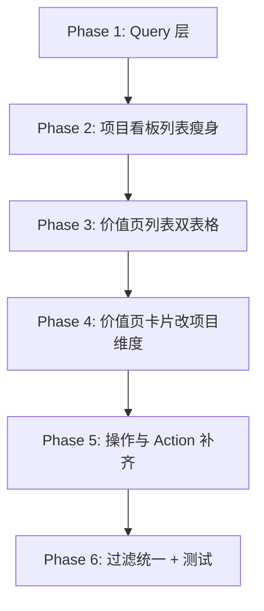

# 项目看板与需求价值跟踪拆分改造方案

> 文档日期：2026-08-03  
> 状态：**Phase 1–6 已完成**  
> 涉及模块：产品管理（`/quarterly-work`）  
> 关联页面：项目看板 Tab、需求价值跟踪 Tab

---

## 一、背景与目标

当前「项目看板」列表同时承担两类信息：

1. **项目进度管理**：名称、负责人、周期、状态、时间等  
2. **项目价值对比**：预期收益、工作量、成本、实际收益、价值判断等  

「需求价值跟踪」Tab 的列表与卡片，目前均以 **跟踪日志**（`RequirementValueTrack`）为展示维度；而价值汇总字段实际存储在 **项目**（`Project`）上。同一项目若有多条跟踪日志，卡片模式下会出现多张同名项目卡片（例如「文献头条」两条日志 → 两张卡）。

本次改造目标：

| 区域 | 改造后职责 |
|------|-----------|
| 项目看板（列表） | 仅保留进度管理相关列 |
| 需求价值跟踪 · 需求价值概览 | 按 **项目** 展示价值汇总 |
| 需求价值跟踪 · 价值跟踪日志 | 按 **日志** 展示历次跟踪记录（列表模式下方，逻辑不变） |

**结论：无需改数据库 Schema**，现有模型已支持拆分。

---

## 二、改造范围对照

### 2.1 项目看板 · 列表模式

#### 现状（13 列）

项目名称、所属产品目标、负责人、规划周期、**预期收益**、**工作量(人天)**、**其他成本**、**实际收益**、**价值判断**、项目状态、创建时间、完成时间、操作（编辑 / 删除 / **价值跟踪**）

代码位置：`src/app/(authenticated)/quarterly-work/content.tsx` 约 1687–1756 行。

#### 目标（8 列）

| 列名 | 数据来源 |
|------|----------|
| 项目名称 | `Project.title` |
| 所属产品目标 | `Project.productGoalTitle` |
| 负责人 | `Project.owner` |
| 规划周期 | `startQuarter ~ endQuarter` |
| 项目状态 | `Project.status` |
| 创建时间 | `Project.createdAt` |
| 完成时间 | `Project.completedAt` |
| 操作 | 编辑、删除、价值跟踪（**Phase 2 暂保留「价值跟踪」**，待价值页稳定后再评估是否移除） |

#### 不在本次改造范围

- **项目看板 · 卡片模式**：当前仅展示任务数等进度信息，无价值字段，**保持不变**。
- **项目编辑弹窗**（`ProjectEditForm`）：仍可保留预期收益、工作量等字段作为录入入口，只是列表不再展示。

---

### 2.2 需求价值跟踪 · 列表模式

#### 现状

单一表格，展示跟踪日志，无区块标题。

#### 目标：上下两个区块

```
┌─ 需求价值概览 ─────────────────────────────────────────┐
│ 项目名称 | 负责人 | 工作量 | 其他成本 | 实际收益 | ... │
└────────────────────────────────────────────────────────┘

┌─ 价值跟踪日志 ─────────────────────────────────────────┐
│ 项目 | 负责人 | 跟踪时间 | 跟踪结果 | 后续优化 | 操作  │  ← 保持现有逻辑
└────────────────────────────────────────────────────────┘
```

#### 上方：需求价值概览（新增）

表格左上方标题：**「需求价值概览」**

| 列名 | 字段来源 |
|------|----------|
| 项目名称 | `Project.title` |
| 负责人 | `ownerMap` |
| 工作量(人天) | `Project.workloadPersonDay` |
| 其他成本 | `Project.otherCost` |
| 实际收益 | `Project.actualValue` |
| 价值判断 | `Project.valueJudgement`，空则显示「观测中」 |
| 项目状态 | `Project.status` |
| 完成时间 | `Project.completedAt` |
| 操作 | 见第四节 |

**展示维度：一项目一行**（与日志条数无关）。

#### 下方：价值跟踪日志（保持不变）

表格左上方标题：**「价值跟踪日志」**

列与交互不变：项目、负责人、跟踪时间、跟踪结果、后续优化、编辑 / 删除。

**展示维度：一日志一行**（可有多行同一项目）。

---

### 2.3 需求价值跟踪 · 卡片模式

#### 现状（跟踪日志维度）

| 项 | 说明 |
|----|------|
| 数据源 | `valueTrackItems`，**一条跟踪日志 = 一张卡片** |
| 分组 | 按关联项目的 `valueJudgement` 分三列：观测中 / 不达预期 / 已达预期 |
| 卡片内容 | 项目名称、负责人、**跟踪时间**、**跟踪结果**、**后续优化** |
| 卡片 key | `track.id`（非 `project.id`） |
| 问题 | 同一项目多条日志 → 多张同名卡片 |

代码位置：`content.tsx` 约 1898–1961 行，`items.map` 使用 `item.id`（即 `track.id`）。

#### 目标（项目维度）

| 项 | 说明 |
|----|------|
| 数据源 | **`valueOverviewItems`**，**一个项目 = 一张卡片** |
| 分组 | 仍按项目的 `valueJudgement` 分三列 |
| 卡片内容 | 项目名称、负责人、工作量、其他成本、实际收益、价值判断、项目状态、完成时间 |
| 卡片 key | `project.id` |
| 操作 | 编辑价值 / 新增跟踪（**不再**提供日志级编辑/删除） |

跟踪日志 **不在卡片模式展示**，仅在列表模式下方「价值跟踪日志」表中展示。

#### 现状 vs 目标对比

| | 现状 | 改造后 |
|---|------|--------|
| 卡片粒度 | 跟踪日志 | 项目 |
| 同一项目多条日志 | 多张卡片 | 一张卡片 |
| 卡片上的时间 | 跟踪时间 `trackedAt` | 完成时间 `completedAt` |
| 卡片核心文本 | 跟踪结果、后续优化 | 工作量、成本、实际收益、价值判断 |
| 列头计数 | 该列日志条数 | 该列项目数 |

---

## 三、数据模型与 Query 层

### 3.1 现有模型（无需变更）

**Project**（价值字段在项目表）：

- `workloadPersonDay`、`otherCost`、`actualValue`、`valueJudgement`
- `status`、`completedAt`

**RequirementValueTrack**（跟踪日志）：

- `projectId`、`trackingResult`、`followUpOptimization`、`trackedAt`

**现有 Action 行为**（`src/server/quarterly-work/actions.ts`）：

- `createValueTrack`：要求项目 `status === "COMPLETED"`；事务内更新 Project 价值字段 + 创建一条日志
- `updateValueTrack`：更新 Project 的 `actualValue`、`valueJudgement` + 更新日志的 `trackingResult`、`followUpOptimization`

### 3.2 新增 `valueOverviewItems`

在 `src/server/quarterly-work/quarterly-work-query.ts` 中新增，与现有 `valueTrackItems` 并列返回：

```typescript
type ValueOverviewItem = {
  id: string;              // projectId
  title: string;
  ownerId: string;
  owner: string;
  departmentOrgNodeId: string | null;
  teamOrgNodeId: string | null;
  workloadPersonDay: number | null;
  otherCost: string | null;
  actualValue: string | null;
  valueJudgement: string;  // 默认 "观测中"
  status: ProjectStatus;
  completedAt: Date | null;
};
```

**数据来源**：权限范围内、`status === "COMPLETED"` 的项目。

**与 `valueTrackItems` 的区别**：

| | valueOverviewItems | valueTrackItems |
|--|-------------------|-----------------|
| 粒度 | 一项目一条 | 一日志一条 |
| 主键 | `project.id` | `track.id` |
| 价值字段 | 直接来自 Project | 日志文本 + 关联 Project 部分字段 |

### 3.3 现有 `valueTrackItems` 补充

建议在映射时补充 `departmentOrgNodeId`、`teamOrgNodeId`（通过关联 project 计算），便于前端与概览表统一做部门/小组过滤。

当前 `valueTrackItems` **未**在前端按部门 Tab / 小组 Tab 过滤，建议本次一并规范。

---

## 四、交互与 Action 设计

### 4.1 概览表 / 概览卡片「操作」列（建议）

| 操作 | 行为 |
|------|------|
| **编辑** | 打开「编辑项目价值」弹窗，修改工作量、其他成本、实际收益、价值判断（不写日志） |
| **新增跟踪** | 复用现有「新增价值跟踪」弹窗（`createValueTrack`） |

不建议在概览区提供「删除项目」——删除职责仍在项目看板。

### 4.2 顶部「+ 新增价值跟踪」

保留，行为不变：选择已完成项目 → 更新 Project 价值字段 + 写入一条日志。

### 4.3 「价值跟踪」入口（分阶段）

**Phase 2～6（当前方案）**：项目看板列表 **保留**「价值跟踪」操作，与价值页新入口并存，降低迁移期操作习惯变化。

| 入口 | 阶段 |
|------|------|
| 项目看板列表 · 操作 · 价值跟踪 | **保留**（Phase 2 不移除） |
| 需求价值概览 · 操作 · 新增跟踪 | Phase 3 起新增 |
| 顶部「+ 新增价值跟踪」 | 始终保留 |

**可选后续**：价值页验收稳定后，再评估是否从项目看板移除「价值跟踪」，避免双入口长期并存。

### 4.4 后端 Action 方案（推荐）

**方案 A（推荐，改动小）**

- 概览「编辑」：新增 `updateProjectValue`（仅更新 Project 价值字段，不写日志）
- 「新增跟踪」：继续用 `createValueTrack`（写日志并同步 Project 价值字段）

**方案 B**

- 概览「编辑」打开完整 `ProjectEditForm`（含状态、周期等），范围偏大，不推荐。

### 4.5 需注意的数据一致性

`createValueTrack` / `updateValueTrack` 会覆盖 Project 上的价值字段。概览「编辑」与「新增跟踪」并存时，以**最后一次写入**为准。UI 上需区分：

- **改汇总**：直接改项目价值字段  
- **记一条日志**：新增跟踪时通常也会更新汇总字段  

---

## 五、过滤规则（建议统一）

| 过滤器 | 需求价值概览 | 价值跟踪日志 |
|--------|-------------|-------------|
| 部门 Tab | `departmentOrgNodeId` | 通过 project 归属过滤 |
| 小组 Tab | `teamOrgNodeId` | 同上 |
| 年 / 季度 | 按 `completedAt`（与项目看板「已完成」列一致） | 按 `trackedAt`（跟踪时间，与日志表语义一致） |

前端新增：

- `visibleValueOverviewItems`
- `visibleValueTrackItems`

复用现有 `belongsToSelectedDepartment` + `teamTab` 过滤模式（参考 `visibleProjectColumns` 实现）。

---

## 六、待产品确认项

1. **概览数据范围**  
   - **建议**：权限内所有 **已完成** 项目（含尚未写过日志的，价值字段为空、价值判断默认「观测中」）  
   - 备选：仅已有至少一条跟踪日志的项目  

2. **日志表的年/季度过滤**  
   - 按 **跟踪时间** `trackedAt`？  
   - 还是按 **项目完成时间** `completedAt`？  

3. **概览「操作」按钮**  
   - 是否采用「编辑 + 新增跟踪」？  
   - 「编辑」是仅价值字段，还是跳转完整项目编辑？  

4. **独立页面 `/value-tracking`**  
   - 当前为旧版 ROI 卡片页（`src/app/(authenticated)/value-tracking/page.tsx`），与 Tab 内价值跟踪功能重复  
   - **建议**：本次不改；或后续对齐到新双区块结构 / 下线  

5. **卡片模式空态**  
   - 已完成但 `valueJudgement` 为空的项目，默认归入「观测中」列  

---

## 七、涉及文件

| 文件 | 改动内容 |
|------|----------|
| `src/server/quarterly-work/quarterly-work-query.ts` | 新增 `valueOverviewItems`；`valueTrackItems` 补充 org 归属字段 |
| `src/app/(authenticated)/quarterly-work/content.tsx` | 项目列表瘦身；价值 Tab 双表格 + 区块标题；卡片改项目维度 |
| `src/server/quarterly-work/actions.ts` | 可选新增 `updateProjectValue` |
| `src/app/(authenticated)/value-tracking/page.tsx` | 本次不改（待后续决策） |

---

## 八、实施步骤



| 阶段 | 内容 |
|------|------|
| Phase 1 | `quarterly-work-query.ts` 新增 `valueOverviewItems` |
| Phase 2 | 项目看板列表删 5 列，调整 grid 布局；**暂不移除**「价值跟踪」操作 |
| Phase 3 | 价值 Tab 列表：上方「需求价值概览」+ 下方「价值跟踪日志」+ 区块标题 |
| Phase 4 | 价值 Tab 卡片：数据源改为 `valueOverviewItems`，一项目一卡，按 `valueJudgement` 分列 |
| Phase 5 | 概览编辑弹窗、`updateProjectValue`（若采用方案 A） |
| Phase 6 | 部门/小组/年季度过滤统一；回归测试 |

可选后续：

- `content.tsx` 拆分为 `ValueOverviewTable`、`ValueTrackLogTable` 等子组件（非必须）
- 价值页稳定后，再从项目看板移除「价值跟踪」操作（非必须）

---

## 九、UI 结构示意

### 列表模式

```
需求价值跟踪 Tab
├── [+ 新增价值跟踪]  [2026年] [Q3]  [卡片 | 列表]
│
├── 需求价值概览                    ← 新增标题
│   └── Table（项目维度，9 列）
│
└── 价值跟踪日志                    ← 新增标题
    └── Table（日志维度，6 列，现有逻辑）
```

### 卡片模式

```
[观测中]          [不达预期]          [已达预期]
 项目概览卡片       项目概览卡片        项目概览卡片
 (一项目一卡)       (一项目一卡)        (一项目一卡)
```

---

## 十、风险与注意事项

1. **一项目多日志**：概览/卡片按项目去重；日志表仍可多行。  
2. **价值字段覆盖**：新增跟踪与直接编辑汇总可能互相覆盖，需在交互文案上区分。  
3. **未完成项目**：概览/卡片建议仅含已完成项目；若产品要求进行中也可填价值，需扩展范围与校验。  
4. **`content.tsx` 体积大（2100+ 行）**：可先内联改，稳定后再拆组件。

---

## 十一、验收清单

- [ ] 项目看板列表仅 8 列，无价值相关列  
- [ ] 项目看板操作列 **仍保留**「价值跟踪」（Phase 2 要求）  
- [ ] 价值 Tab 列表上方有「需求价值概览」表（项目维度）  
- [ ] 价值 Tab 列表下方有「价值跟踪日志」表，内容与现有一致  
- [ ] 价值 Tab 卡片模式按 **项目** 展示，同一项目仅一张卡  
- [ ] 卡片不再展示跟踪结果、后续优化、跟踪时间  
- [ ] 部门/小组/年季度过滤对两表生效（按第五节确认规则）  
- [ ] 新增跟踪后概览与日志同步更新  
- [ ] 项目编辑弹窗仍可录入价值相关字段（列表不展示）

---

## 十二、参考代码位置

| 说明 | 路径 / 行号 |
|------|------------|
| 项目列表 13 列 | `content.tsx` ~1687–1756 |
| 价值跟踪卡片（日志维度） | `content.tsx` ~1898–1961 |
| 价值跟踪列表（日志） | `content.tsx` ~1962–2007 |
| `valueTrackItems` 组装 | `quarterly-work-query.ts` ~700–713 |
| `createValueTrack` / `updateValueTrack` | `actions.ts` ~530–618 |
| `ProjectBoardItem` 类型 | `quarterly-work-query.ts` ~57–81 |
| 独立价值跟踪页（本次不改） | `value-tracking/page.tsx` |
