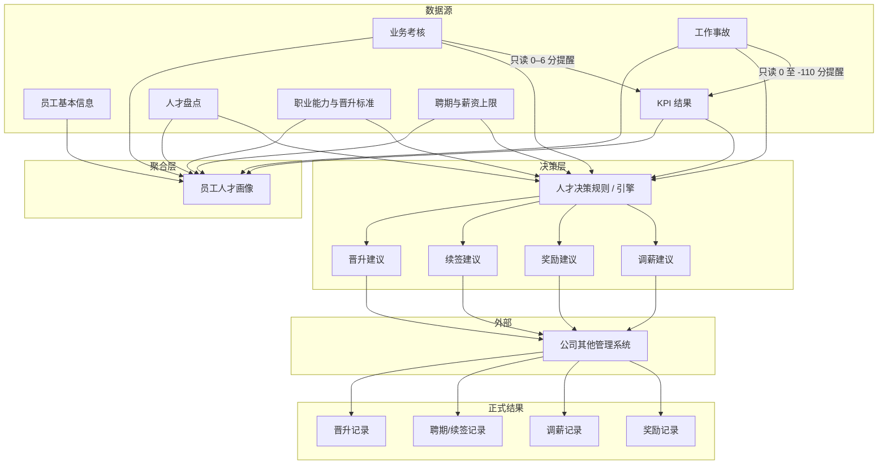

# 人才发展模块 · 设计理念与需求说明

> **文档性质**：可复用的产品/设计/开发需求基线  
> **适用项目**：产品部管理工作台（depot-KPI）  
> **更新日期**：2026-08-27  
> **来源**：`人才发展模块设计方案.md`、第 0 轮基线、综合决策规则交接、规则配置中心交接、KPI 迁移交接及当前实现  
> **用途**：新成员 onboarding、跨模块协作对齐、后续迭代的需求锚点

---

## 1. 模块定位

人才发展模块是产品部管理台的 **HR 能力域**，服务于部门负责人、组长和 HR 管理员，目标不是替代公司正式审批系统，而是：

1. **聚合**员工档案、KPI、人才盘点、职业能力、业务考核、工作事故、聘期与薪资上限等多源数据；
2. **形成可解释、可追溯**的员工人才画像与部门决策建议；
3. **独立登记**晋升、续签、调薪、奖励等正式履历（公司审批在外部系统完成）；
4. **向 KPI 模块提供只读扣分提醒**，不写入 KPI 评分。

一句话概括：**本系统负责「算资格、看证据、出建议、记结果」；公司正式审批与生效在其他系统完成。**

---

## 2. 四条核心设计理念

### 2.1 模型独立、决策聚合

| 子系统 | 职责 | 不做什么 |
|--------|------|----------|
| **人才盘点** | 评价员工在某一周期内的**当前状态**（六维 → 总分/等级/九宫格） | 不定义岗位晋升标准 |
| **职业能力模型** | 定义岗位职级、能力要求与**晋升标准** | 不参与盘点总分计算 |
| **人才决策** | 同时引用盘点、能力模型、KPI、考核、事故、聘期、薪资等 | 不替代各子模型各自保存的数据 |

两套评价模型 **独立配置、独立计算、独立保存**；晋升/续签/调薪/奖励规则在上层 **聚合引用**，避免「盘点分直接等于晋升资格」的耦合。

### 2.2 建议与正式结果分离

```text
部门决策建议  ──可选关联──▶  正式履历（晋升/续签/调薪/奖励）
     │                              │
  记录「建议做什么、为什么、      记录「实际发生了什么」
   公司是否采纳」                 可来自建议、公司直决、历史导入
     │                              │
  未采纳 ──▶ 仅保留建议记录      不要求必须有建议来源
```

- 一条建议只对应 **一种决策类型**（避免「晋升并调薪」在公司只采纳一项时无法独立记录）。
- 正式结果允许来源：`部门建议` / `公司直接决定` / `历史导入` / `人工登记`。
- **不得**从建议状态反推员工履历；**不得**从未采纳建议自动生成正式记录。

### 2.3 规则与模型版本化

- 人才盘点模型、职业能力模型、KPI 等级区间、事故处罚、人才决策规则均 **版本化**。
- 发布后 **不可直接修改业务字段**，只能复制产生新版本并发布；旧版本退役。
- 正式盘点、决策批次、建议记录保存 **当时使用的模型/规则版本及证据快照**，保证历史结论可还原、可审计。
- 同一配置类型、同一作用域在同一时间最多一个 `ACTIVE` 版本。

### 2.4 系统建议 ≠ 正式人事决定

| 本系统负责 | 本系统不负责 |
|------------|--------------|
| 计算资格、识别限制、展示证据、形成部门建议 | 公司正式审批流 |
| 关联外部流程编号/链接 | 审批通过/驳回的状态机 |
| 登记正式结果供历史查询与后续分析 | 工资核算、劳动合同系统 |

---

## 3. 总体业务架构



**关键边界**：

- 业务考核、工作事故的 **日常维护入口在 KPI 管理**；人才模块保留规则引用、结果消费与查看。
- KPI 详情 **只读查询** 人才模块，**不写入** `PersonalKpiItem.managerScore`。
- 人才决策规则 **配置中心** 与 **决策引擎** 解耦：配置中心只维护规则定义，引擎读取后扫描命中、生成限制与建议。

---

## 4. 信息架构与页面设计

### 4.1 导航与壳层

- 侧栏入口：**人才发展** → `/talent`
- 与产品管理一致：**页面自管页头**（标题 + 说明 + Tab），不占用 App Shell 全局 Header
- 背景 `#F5F7F9`，内容区白卡片，品牌色 Tab 下划线 `#3069F9`

### 4.2 一级 Tab 工作台（五 Tab 单页架构）

| Tab | 用户心智 | 核心能力 |
|-----|----------|----------|
| **人才总览** | 「部门人才全景」 | 九宫格分布、快捷预警卡片、人才画像列表、侧滑详情 |
| **人才盘点** | 「周期性评价当前状态」 | 批次创建、六维评价、校准、确认、归档 |
| **人才决策** | 「部门建议与证据」 | 晋升/续签/调薪/奖励建议、资格解释、公司反馈 |
| **人才履历** | 「正式发生过什么」 | 档案、晋升/续签/调薪/奖励正式记录、批量导入 |
| **规则配置** | 「制度如何被系统表达」 | 能力评估、职业通道、能力模型、决策规则等 |

### 4.3 深链路由（从 Tab 或链接进入）

| 路径 | 用途 |
|------|------|
| `/talent/reviews`、`/talent/reviews/[cycleId]` | 盘点批次列表与单批次详情 |
| `/talent/recommendations` | 集中决策台（4/10 月节点、考察期） |
| `/talent/history` | 正式履历全页管理 |
| `/talent/employees` | 员工人才档案 |
| `/talent/config/reviews` | 人才能力评估 + 盘点模型 |
| `/talent/config/career` | 职业通道 |
| `/talent/config/competencies` | 职业能力模型 |

### 4.4 交互设计原则

1. **列表 ↔ 详情 ↔ 编辑** 三级工作区，统一「返回」导航，避免多层弹窗嵌套。
2. **员工侧滑 Drawer**（约 720px）：总览入口点击行打开，承载画像概览及子 Tab。
3. **空状态明确**：表格空行提示调整筛选；无数据时区分「无权限」与「暂无记录」。
4. **操作反馈**：成功/错误条 + 导入错误行明细；Toast 固定底部居中约 2.2s。
5. **删除二次确认**；版本发布走「草稿 → 校验 → 发布 → 退役」。
6. **敏感字段**（薪资、内部评语等）：无权限时隐藏 + 琥珀色提示，服务端 DTO 裁剪，不依赖前端隐藏。
7. **用户界面禁止填写业务编码**：编码系统生成，用户只操作名称与选项。

---

## 5. 领域模型设计要点

### 5.1 人才盘点

**六维模型**（当前正式模板）：

| 能力域 | 维度 |
|--------|------|
| 价值观 | 忠诚度、工作态度 |
| 发展潜力 | 匹配度、成长度 |
| 能力 | 能力度、产出度 |

- 维度等级 S/A/B/C/D → 5/4/3/2/1 分；六维汇总得总分与盘点级别。
- **九宫格**：横轴潜力、纵轴绩效；**仅辅助视图**，正式映射确定前不参与自动决策。
- **完整性规则**：必填维度未全部完成时 `totalScore = null`、`grade = null`，**未完成 ≠ D 级**。
- 批次状态：`IN_PROGRESS → CALIBRATING → CONFIRMED → ARCHIVED`。
- 同一员工每半年只能参加一个盘点批次；部门主管不纳入九宫格统计。

### 5.2 人才能力评估（能力匹配度）

在盘点模型之上增加 **KPI 与盘点权重**（默认 0.6 / 0.4，之和必须为 1）：

```text
能力匹配度 = (KPI 均值 / KPI 总分) × kpiWeight + (盘点均值 / 盘点总分) × reviewWeight
```

权重读 ACTIVE 模板版本；无配置时兜底 0.6 / 0.4。

### 5.3 职业发展通道与能力模型

```text
职业通道 → 岗位序列 → 具体岗位 → 职级段 → 具体职级档（如 R3-1）
能力库 → 能力包 → 岗位能力模型版本 → 职级要求
```

- 职级上下级通过 `rankOrder` / `stepOrder` 管理，**禁止**解析 `R3-2` 字符串判断层级。
- 岗位模型未发布时不生成晋升能力达标结论；C 端等产品模型可后续补配。

### 5.4 业务考核

- 只保存 **最终结果**（正常及格 / 补考及格 / 最终不及格），不记录考试过程明细。
- KPI 计分：总分固定 6 分均摊科目；补考及格为单科满分 50%。
- **维护入口**：KPI 管理 → 业务考核 Tab；人才模块消费结果。

### 5.5 工作事故

- 事故等级 S > A > B > C > D；**事故 S = 最严重**，与盘点/KPI 的 S（优秀）**语义相反，独立枚举**。
- KPI 扣分：D 每次 -10，C 每次 -40，存在 B/A/S 则工作事故项 -110（上限 110）。
- 除 KPI 外还可限制晋升、调薪、奖励、续签等；公司与部门规则同时命中时取 **更严格且截止时间更晚** 的结果。
- **维护入口**：KPI 管理 → 工作事故 Tab。

### 5.6 聘期与薪资

- 每段聘期独立保存（第几聘期、起止、续签决定等），不只依赖 `User.contractRenewAt`。
- 薪资上限按职级段配置（R1–R6），具体职级档可覆盖；首期不做工资核算。
- 员工档案含 **人才决策事实**（三态：待更新 / 是 / 否）：聘期内 2 次 C、连续 2 次 C、续聘前最近 C、聘期内无正式晋升等。

### 5.7 人才决策

**建议类型**：晋升、续签、调薪、奖励（季度奖励与年终奖励拆分）。

**决策节点**（综合引擎目标）：每年 **4 月、10 月** 固定节点；考察期为节点向前半年，非自然半年：

- 4 月节点：上年 10/1 – 当年 3/31  
- 10 月节点：当年 4/1 – 9/30  

晋升与调薪 **共用半年快照、分别计算资格**，允许「建议晋升但暂不调薪」。

**规则配置中心**（已落地）：维护触发字段 + 处罚规则；**不执行**扫描、限制生成、自动建议（由未来引擎读取）。

### 5.8 正式履历

- 晋升登记同步更新员工当前职级/薪资；历史记录不变。
- 支持 CSV/XLSX 批量导入：上传 → 映射 → 匹配 → 预检 → 确认 → 入库；错误行可下载。
- 员工时间轴由多表聚合查询，**不另建重复事件总表**。

---

## 6. 与 KPI 模块的协作契约

### 6.1 查询键

```text
PersonalKpi.userId + PersonalKpi.year + PersonalKpi.quarter
```

### 6.2 提醒展示

- 位置：KPI 详情 **汇总行说明区**（不依赖指标名称或模板业务键）。
- 内容：业务考核应扣分摘要、工作事故扣分与限制摘要；分别注明应计入「日常工作考核」「工作事故」指标。
- 文案：**「请与本指标其他扣分合并填写」**——提醒值不是指标项全部扣分。
- 无扣分 / 待确认 / 查询失败 **必须区分展示**，不能伪装为无扣分。

### 6.3 硬性约束

- 人才模块 **不修改** KPI 分数与 `managerScore`。
- 查询失败 **降级展示**，不影响 KPI 原有评分页。
- 详情链接遵循人才模块数据权限。

---

## 7. 权限与数据范围

复用组织权限 `OrgPermissionGrant`，模块键 `TALENT`，数据范围 `SELF / NODE / SUBTREE / ALL`。

| 角色 | 典型范围 | 能力概要 |
|------|----------|----------|
| 系统管理员 | ALL | 全部人才能力 |
| 部门负责人 | SUBTREE | 配置、盘点、建议、履历、敏感字段 |
| 组长 | NODE | 盘点评价/管理、建议草稿、查看下属 |
| 普通成员 | SELF | 只读本人画像、公开盘点结果、本人履历 |

关键能力键：`VIEW/EDIT_TALENT_PROFILE`、`VIEW/MANAGE_TALENT_REVIEW`、`CALIBRATE_TALENT_REVIEW`、`VIEW/MANAGE_RECOMMENDATION`、`VIEW/MANAGE_TALENT_HISTORY`、`VIEW_TALENT_SENSITIVE`、`MANAGE_TALENT_CONFIG` 等。

业务考核/事故 **管理** 权限在 KPI 模块：`MANAGE_BUSINESS_ASSESSMENT`、`MANAGE_WORK_INCIDENT`。

**实现要求**：Query 层按权限过滤；Action 层二次校验；返回 DTO 含 `canManage` / `canViewSensitive` 等标志。

---

## 8. 服务端架构约定

```text
src/server/talent/
├── review-*          盘点查询/动作/计算引擎
├── profile-*         画像与能力匹配度
├── assessment-*      业务考核（消费为主）
├── incident-*        工作事故（消费为主）
├── decision-*        建议、批次、引擎
├── restriction-rule-* 决策规则配置中心
├── history-*         正式履历与导入
├── config-*          职业通道、能力模型
└── kpi-deduction-*   KPI 只读扣分提醒
```

设计约定：

- 纯计算函数 + 单元测试（`*.test.ts`）。
- Prisma 写入集中在 Server Actions；确认/发布/作废走事务 + 审计日志。
- 页面不直接暴露 Prisma 敏感模型。

---

## 9. 数据导入通用流程

```text
上传 → 字段映射 → 员工匹配 → 业务校验 → 预检报告 → 人工确认 → 正式写入 → 回读核对
```

员工匹配优先级：工号 → 钉钉 ID → 姓名+小组 → 仅姓名时人工确认。

首期支持：聘期与历史晋升、历史盘点、业务考核、正式履历批量导入。

---

## 10. 实施分期（参考）

| 轮次 | 主题 | 验收要点 |
|------|------|----------|
| 0 | 基线与详细设计 | 规则可落入数据模型；不破坏现有 migration |
| 1 | 基础数据与配置底座 | 权限正确；敏感字段不越权 |
| 2 | 人才盘点 | 未完成 ≠ D；历史版本可回溯 |
| 3 | 职业发展 | 新增岗位/职级不需改代码 |
| 4 | 业务考核与工作事故 | KPI 只读提醒正确；查询不写 KPI |
| 5 | 部门决策建议 | 建议可解释；未采纳不生成正式结果 |
| 6 | 正式结果与历史 | 可独立查全量履历；正式结果不依赖建议存在 |

---

## 11. 风险与停止条件（设计约束）

| 风险 | 应对 |
|------|------|
| 事故 S 与盘点 S 语义冲突 | 独立枚举与展示文案 |
| 盘点维度缺失被算成 D | 计算前校验完整性 |
| KPI 提醒查询失败 | 降级展示，可关闭提醒功能 |
| 已发布规则被直接修改 | 版本化 + 只允许新版本 |
| 薪资/评语/事故责任越权 | 字段级权限 + 服务端裁剪 |
| 正式结果随当前岗位变化 | 历史记录快照保存 |

**停止上线条件**：数据权限越权；KPI 查询写分或查错人/季；历史盘点无法用锁定模型复现；正式结果历史展示随当前状态漂移。

---

## 12. 当前实现成熟度（2026-08-27）

| 能力 | 状态 |
|------|------|
| 数据模型 + 权限 + 盘点全流程 | ✅ 生产可用 |
| 规则配置（能力评估、职业通道、能力模型、14 条决策规则） | ✅ 定义维护 |
| 员工档案 + 正式履历 + 导入 | ✅ |
| 业务考核 + 事故 + KPI 扣分提醒 | ✅（维护在 KPI） |
| 人才总览（有盘点批次时） | ✅ 真实数据 |
| 综合决策引擎（4/10 月批次自动计算） | 🔄 重构中，批次只读 |
| PersonDrawer 部分 Tab / 无盘点时总览 | ⚠️ 仍含静态演示回退 |
| 团队筛选下拉 | ⚠️ 部分硬编码，待接组织树 |

---

## 13. 需求覆盖检查表

复制到新功能评审时使用：

| 检查项 | 是否符合设计理念 |
|--------|------------------|
| 新能力是否明确属于「数据源 / 画像 / 建议 / 正式结果 / 配置」之一？ | |
| 是否与其他模型（盘点 vs 能力 vs KPI）保持独立，仅在决策层聚合？ | |
| 建议与正式结果是否分表/分状态，且未采纳不自动生成履历？ | |
| 是否使用版本化配置，且发布后不直接改历史？ | |
| KPI 集成是否只读、不写分、失败可降级？ | |
| 敏感字段是否服务端裁剪 + 独立权限？ | |
| 用户是否无需填写内部编码？ | |
| 历史结论是否保存证据快照与规则版本？ | |
| 是否在本系统边界内（不做公司审批）？ | |

---

## 14. 参考文档索引

| 文档 | 路径 |
|------|------|
| 完整设计方案 | `requirements/人才发展模块设计方案.md` |
| 第 0 轮基线与字段设计 | `requirements/人才发展模块第0轮基线与详细设计.md` |
| 综合决策规则交接 | `requirements/handoff/talent/2026-08-12-人才发展综合决策规则设计与开发交接.md` |
| 规则配置中心进度 | `requirements/handoff/talent/2026-08-17-人才决策规则配置中心当前进度交接.md` |
| KPI 迁移交接 | `requirements/handoff/talent/2026-08-20-人才能力评估与KPI模块迁移进度交接.md` |
| 主 UI 实现 | `src/app/(authenticated)/talent/content.tsx` |
| 服务端实现 | `src/server/talent/` |

---

## 15. 结论（设计理念摘要）

人才发展模块的设计，始终围绕 **「独立模型、聚合决策、建议与结果分离、版本可追溯、KPI 只读联动、系统不代行公司审批」** 展开。任何新需求应优先回答：它增强的是 **看清人（画像）**、**评价人（盘点）**、**定标准（能力/规则）**、**出建议（决策）** 还是 **记结果（履历）**——并严格落在对应边界内，避免把配置、建议、正式结果和 KPI 写回混为一谈。
