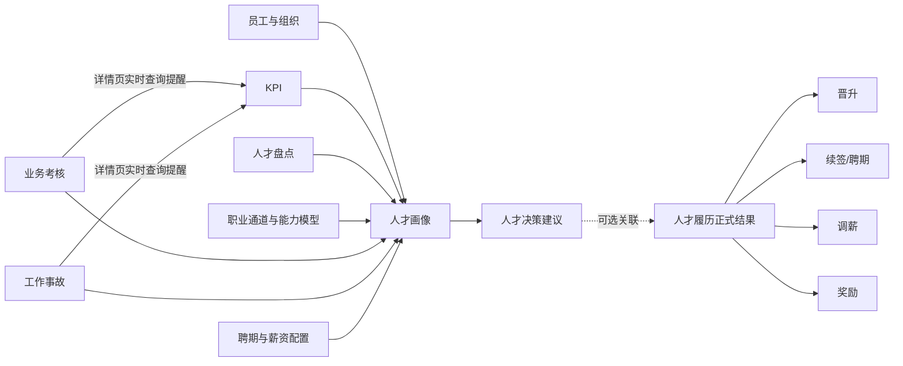

# 人才发展模块第 0 轮基线与详细设计

> 执行日期：2026-08-06  
> 工作区：`depot-coordination/depot-KPI`  
> 分支：`depot-KPI`  
> 基线提交：`4743f69`  
> 本轮性质：只读核对与详细设计，不修改 Schema、不创建 migration、不写业务数据

## 1. 本轮结论

第 0 轮通过，可以进入第 1 轮开发，但必须遵守以下前置结论：

1. 人才模块复用现有 `OrgPermissionGrant` 和 `SELF/NODE/SUBTREE/ALL` 数据范围，不另建第二套组织权限。
2. `OrgPermissionModuleKey` 必须新增 `TALENT`，`OrgPermissionAbilityKey` 必须新增人才模块能力键。
3. 人才扣分提醒统一放在 KPI 详情“汇总”行的说明区域，不依赖模板项名称或业务键，因此不修改 KPI 模板和快照表结构。
4. KPI 详情按当前 `PersonalKpi.userId + year + quarter` 直接查询人才模块中的业务考核和工作事故结果，只展示应扣分提醒。
5. 人才模块不写入 `PersonalKpiItem.managerScore`；主管将提醒分数与周报、分享、投诉等其他事项合并后填写 KPI 扣分。
6. 人才决策建议与人才履历正式结果必须使用独立表保存，正式结果可不关联建议。
7. 人才盘点模型、职业能力模型和决策规则均采用发布版本加业务快照，禁止修改已发布版本导致历史漂移。
8. 当前未提交的产品管理 migration 和人才发展原型均视为用户已有成果，后续不得覆盖或回退。

## 2. 当前基线

### 2.1 Git 状态

当前受跟踪修改：

```text
M src/app/(authenticated)/talent/page.tsx
```

当前未跟踪内容：

```text
db/prisma/migrations/20260804000100_add_product_management_schema/
requirements/人才发展模块设计方案.md
```

保护规则：

- 第 1 轮 migration 使用新的时间戳目录，不能修改 `20260804000100_add_product_management_schema`。
- 当前 `/talent` 原型作为交互基准逐步拆分，不直接丢弃。
- 不执行 `git reset`、`git checkout --` 或任何清理未跟踪文件的操作。

### 2.2 数据库状态

```text
database: db/dev.db
size: 1007616 bytes
sha256: 350737ee442943dcc6e2b6f364565f501c4b46af33de89aadbc086dd4d21bb26
integrity_check: ok
applied migrations: 39
User: 24
OrgNode: 14
MenuPermission: 8
OrgPermissionGrant: 63
PersonalKpi: 0
KpiTemplate: 0
KpiTemplateItem: 0
```

Prisma 状态：`Database schema is up to date`。

说明：开发库当前没有 KPI 模板和个人 KPI 数据，因此只能验证结构和代码链路，不能用本库验证 KPI 详情对人才扣分结果的查询展示。第 4 轮必须补充固定夹具和数据库集成测试。

### 2.3 可复用能力

- 用户及组织：`User`、`OrgNode`、`OrgClosure`。
- 菜单权限：`MenuPermission`、`RoleMenuPermission`。
- 业务权限：`OrgPermissionGrant`。
- 数据范围：`SELF`、`NODE`、`SUBTREE`、`ALL`。
- KPI 模板和快照：`KpiTemplateItem`、`PersonalKpiItem`。
- 登录用户和组织范围解析器。
- Excel 读取库 `xlsx` 及 KPI 模板导入的校验模式。
- 通知类型已有 `TALENT_WARNING`，首期可复用。

### 2.4 当前缺口

- 没有人才模块数据库模型。
- `OrgPermissionModuleKey` 只有 `ANNUAL_GOAL/KPI`。
- `OrgPermissionAbilityKey` 没有人才能力键。
- KPI 详情当前没有汇总级外部扣分提醒区域和人才结果查询。
- KPI 评分 Action 使用一个 `managerScore` 总扣分字段，因此人才模块只提供提醒，不能直接覆盖或追加该字段。
- `/talent` 仍是单文件客户端模拟数据原型。
- 没有通用导入批次、预检行和错误报告结构。
- 没有敏感字段级授权判断。

## 3. 核心领域边界



边界约束：

- 人才盘点评价当前状态；能力模型定义晋升标准，两者不互相生成数据。
- 人才决策可以同时引用盘点、能力模型、KPI、考核、事故、聘期和薪资规则。
- 公司审批在其他系统完成，本系统不新增审批流。
- 建议被采纳后仍需登记正式结果；不得从建议状态反推员工履历。

## 4. 枚举详细设计

### 4.1 权限与通用版本

```text
OrgPermissionModuleKey += TALENT

TalentVersionStatus = DRAFT | ACTIVE | RETIRED
TalentRecordStatus  = DRAFT | CONFIRMED | VOIDED
ImportBatchStatus   = UPLOADED | MAPPED | VALIDATED | CONFIRMED | FAILED | CANCELLED
ImportRowStatus     = PENDING | VALID | INVALID | IMPORTED | SKIPPED
```

发布约束：同一配置类型、同一作用域在同一时间最多一个 `ACTIVE` 版本；已发布版本只允许退役，不允许改业务字段。

### 4.2 人才盘点

```text
TalentReviewCycleStatus = DRAFT | IN_PROGRESS | CALIBRATING | CONFIRMED | ARCHIVED
TalentReviewParticipantStatus = PENDING | COMPLETED | CONFIRMED
TalentRatingCode = S | A | B | C | D
```

注意：人才盘点的 S 表示最高评价。

### 4.3 业务考核

```text
AssessmentScoringType = GRADE | NUMERIC
AssessmentAttemptResult = INITIAL_PASS | RETEST_PASS | FINAL_FAIL
AssessmentCycleStatus = DRAFT | IMPORTING | CONFIRMED | ARCHIVED
```

系统只保存最终结果；`INITIAL_PASS/RETEST_PASS/FINAL_FAIL` 是最终结论，不记录考试过程明细。

### 4.4 工作事故

```text
WorkIncidentLevel = S | A | B | C | D
WorkIncidentStatus = DRAFT | CONFIRMED | VOIDED
RestrictionType = PROMOTION | CONTRACT_RENEWAL | SALARY_ADJUSTMENT | REWARD
```

注意：事故 S 表示最严重，不能复用人才盘点等级枚举。

### 4.5 人才决策与履历

```text
TalentDecisionType = PROMOTION | CONTRACT_RENEWAL | SALARY_ADJUSTMENT | REWARD
RecommendationStatus = DRAFT | PROPOSED | DEFERRED | NOT_RECOMMENDED | HANDED_OFF | CLOSED
CompanyFeedbackStatus = PENDING | ADOPTED | ADJUSTED_ADOPTION | REJECTED | DEFERRED
TalentHistorySourceType = RECOMMENDATION | COMPANY_SYSTEM | MANUAL_IMPORT | MANUAL_ENTRY
```

## 5. Prisma 模型详细设计

以下字段均为目标结构。所有业务表默认包含 `id`、`createdAt`、`updatedAt`；需要撤销/停用的表增加 `deletedAt` 或状态字段，不进行普通硬删除。

### 5.1 员工人才基础资料

#### `EmployeeTalentProfile`

| 字段 | 类型 | 说明 |
|---|---|---|
| `userId` | String unique | 对应员工 |
| `jobRoleId` | String? | 当前岗位 |
| `jobLevelId` | String? | 当前具体职级档 |
| `managerUserId` | String? | 人才管理直属负责人快照/补充 |
| `currentSalary` | Decimal?/Int? | 敏感字段，首期建议以整数分或整数元保存 |
| `salaryCurrency` | String | 默认 CNY |
| `profileNote` | String? | 内部说明 |
| `updatedById` | String | 最后维护人 |

约束：`@@unique([userId])`；索引 `jobRoleId`、`jobLevelId`、`managerUserId`。

`User.title` 保留用于组织通讯录展示；人才模块的岗位和职级以本表为准。

#### `EmploymentContractTerm`

| 字段 | 类型 | 说明 |
|---|---|---|
| `userId` | String | 员工 |
| `contractNo` | String? | 合同编号 |
| `startDate`/`endDate` | DateTime | 聘期 |
| `renewalSequence` | Int | 第几次签订/续签 |
| `resultStatus` | TalentRecordStatus | 正式状态 |
| `recommendationId` | String? | 可选关联建议 |
| `sourceType` | TalentHistorySourceType | 来源 |
| `externalProcessNo` | String? | 公司系统流程号 |
| `confirmedById`/`confirmedAt` | String?/DateTime? | 确认信息 |
| `voidReason` | String? | 撤销原因 |

约束：`@@unique([userId, startDate, renewalSequence])`；索引 `[userId,endDate]`、`recommendationId`、`externalProcessNo`。

迁移兼容：`User.contractRenewAt` 在第 1 轮只读保留；有正式合同记录后由查询层优先取最新 `EmploymentContractTerm.endDate`，暂不删除旧字段。

#### `SalaryCapConfig`

| 字段 | 类型 | 说明 |
|---|---|---|
| `departmentOrgNodeId` | String | 部门作用域 |
| `jobLevelGroupId` | String | R1-R6 职级组 |
| `jobLevelId` | String? | 可选细分档覆盖 |
| `maxSalary` | Int | 薪资上限 |
| `currency` | String | 默认 CNY |
| `effectiveFrom`/`effectiveTo` | DateTime/DateTime? | 生效期 |
| `versionStatus` | TalentVersionStatus | 状态 |
| `createdById` | String | 创建人 |

约束：启用时业务校验同一作用域、职级和生效期不重叠；索引 `[departmentOrgNodeId,jobLevelGroupId,effectiveFrom]`。

### 5.2 职业通道与能力模型

#### 结构表

- `CareerTrack(code,name,departmentOrgNodeId,description,sortOrder,isActive)`
- `JobFamily(code,name,careerTrackId,description,sortOrder,isActive)`
- `JobRole(code,name,jobFamilyId,description,sortOrder,isActive)`
- `JobLevelGroup(code,name,rankOrder,description,isActive)`，如 R3。
- `JobLevel(code,name,jobLevelGroupId,stepOrder,displayOrder,isActive)`，如 R3-1/R3-2/R3-3。

唯一约束：

```text
CareerTrack:  [departmentOrgNodeId, code]
JobFamily:    [careerTrackId, code]
JobRole:      [jobFamilyId, code]
JobLevelGroup:[code]
JobLevel:     [jobLevelGroupId, code]
JobLevel:     [jobLevelGroupId, stepOrder]
```

#### 能力表

- `CompetencyItem(code,name,category,description,measurementGuide,isActive)`。
- `CompetencyPackage(code,name,description,status,version,createdById,publishedAt)`。
- `CompetencyPackageItem(packageId,competencyItemId,weight,sortOrder)`。
- `CompetencyModelVersion(code,name,jobRoleId,targetJobLevelId,status,version,description,createdById,publishedAt)`。
- `JobLevelRequirement(modelVersionId,competencyItemId,requiredLevel,weight,isMandatory,evidenceRequirement,sortOrder)`。
- `PromotionPath(fromJobLevelId,toJobLevelId,jobRoleId,isActive,sortOrder)`。

约束：

```text
CompetencyPackage:       [code, version]
CompetencyPackageItem:   [packageId, competencyItemId]
CompetencyModelVersion:  [jobRoleId, targetJobLevelId, version]
JobLevelRequirement:     [modelVersionId, competencyItemId]
PromotionPath:           [jobRoleId, fromJobLevelId, toJobLevelId]
```

#### 晋升规则和证据

- `PromotionRuleGroup(modelVersionId,name,logicOperator,sortOrder)`，`logicOperator=ALL|ANY`。
- `PromotionRule(groupId,ruleType,operator,expectedValueJson,description,sortOrder)`。
- `PromotionEvidence(userId,modelVersionId,requirementId,evidenceType,evidenceValueJson,evidenceDate,sourceType,sourceId,confirmedById)`。

`ruleType` 首期允许：`KPI_SCORE`、`TALENT_GRADE`、`BUSINESS_ASSESSMENT_PASS`、`NO_ACTIVE_INCIDENT_RESTRICTION`、`COMPETENCY_LEVEL`、`TENURE_MONTHS`。

### 5.3 人才盘点

#### 模型版本

- `TalentReviewTemplateVersion(code,name,departmentOrgNodeId,version,status,description,createdById,publishedAt)`。
- `TalentReviewDimension(templateVersionId,code,name,category,weight,sortOrder,isRequired)`。
- `TalentRatingOption(templateVersionId,code,label,numericScore,sortOrder)`。
- `TalentGradeThreshold(templateVersionId,gradeCode,label,minScore,maxScore,sortOrder)`。
- `TalentNineBoxRule(templateVersionId,code,label,potentialMin,potentialMax,performanceMin,performanceMax,colorToken,sortOrder)`。

约束：

```text
TemplateVersion: [departmentOrgNodeId, code, version]
Dimension:       [templateVersionId, code]
RatingOption:    [templateVersionId, code]
GradeThreshold:  [templateVersionId, gradeCode]
NineBoxRule:     [templateVersionId, code]
```

发布校验：等级区间不能重叠；当前六维默认 `S=5/A=4/B=3/C=2/D=1`；总分区间覆盖 0-30，但维度未完成时不计算。

#### 盘点业务数据

- `TalentReviewCycle(year,quarter,name,departmentOrgNodeId,templateVersionId,status,startedAt,confirmedAt,archivedAt,createdById)`。
- `TalentReviewParticipant(cycleId,userId,orgNodeIdSnapshot,jobRoleIdSnapshot,jobLevelIdSnapshot,status,reviewerId,confirmedById,confirmedAt)`。
- `TalentReviewDimensionResult(participantId,dimensionId,ratingCode,numericScore,comment,evaluatorId,evaluatedAt)`。
- `TalentReviewResult(participantId,totalScore,gradeCode,potentialScore,performanceScore,nineBoxCode,talentType,backupUserId,appointmentSuggestion,managerComment,calculatedAt,confirmedAt)`。

约束：

```text
TalentReviewCycle:           [departmentOrgNodeId, year, quarter]
TalentReviewParticipant:     [cycleId, userId]
TalentReviewDimensionResult: [participantId, dimensionId]
TalentReviewResult:          [participantId]
```

快照要求：参与人组织、岗位、职级以及模板版本在批次开始时冻结。

### 5.4 业务考核

- `BusinessAssessmentCycle(year,quarter,name,departmentOrgNodeId,status,totalKpiScore,createdById,confirmedById,confirmedAt)`。
- `BusinessAssessmentSubject(cycleId,code,name,scoringType,passingNumericScore,requiredGradeCode,maxScore,sortOrder)`。
- `BusinessAssessmentResult(cycleId,subjectId,userId,rawFinalValue,attemptResult,isPassed,earnedScore,sourceImportRowId,confirmedAt)`。
- `BusinessAssessmentSummary(cycleId,userId,subjectCount,passedSubjectCount,earnedScore,maxScore,isOverallPassed,calculatedAt)`。

约束：

```text
Cycle:  [departmentOrgNodeId, year, quarter]
Subject:[cycleId, code]
Result: [cycleId, subjectId, userId]
Summary:[cycleId, userId]
```

计分：

```text
subjectMax = 12 / subjectCount
INITIAL_PASS = subjectMax
RETEST_PASS  = subjectMax / 2
FINAL_FAIL   = 0
summaryScore = sum(subjectEarnedScore)
kpiPenalty   = summaryScore - 12  // 范围 -12 到 0
```

小数处理：数据库保留至少 4 位计算精度，展示保留 2 位；最后一个科目承担均摊舍入差，保证科目满分合计严格等于 12。

### 5.5 工作事故

- `WorkIncident(incidentNo,title,description,occurredAt,departmentOrgNodeId,level,status,confirmedById,confirmedAt,voidedById,voidedAt,voidReason,externalReferenceNo)`。
- `WorkIncidentResponsiblePerson(incidentId,userId,responsibilityRate,isPrimary,confirmedFact,createdAt)`。
- `WorkIncidentAction(incidentId,actionType,description,effectiveFrom,effectiveTo,createdById)`。
- `IncidentRestriction(incidentId,userId,restrictionType,effectiveFrom,effectiveTo,isActive,releaseReason,releasedById,releasedAt)`。
- `WorkIncidentQuarterSummary(userId,year,quarter,cCount,dCount,hasSevereIncident,kpiPenalty,calculatedAt)`。

约束：

```text
WorkIncident:                  [incidentNo]
WorkIncidentResponsiblePerson: [incidentId, userId]
IncidentRestriction:           [incidentId, userId, restrictionType]
WorkIncidentQuarterSummary:    [userId, year, quarter]
```

计分：

```text
if any S/A/B: penalty = -110
else penalty = -min(110, C_COUNT * 40 + D_COUNT * 10)
```

事故取消或等级变更后必须从所有有效事故重算季度汇总，不对旧扣分做增量相减。

### 5.6 人才决策

#### `TalentDecisionRecommendation`

| 字段 | 说明 |
|---|---|
| `recommendationNo` | 唯一编号 |
| `userId`、`departmentOrgNodeId` | 对象及作用域 |
| `decisionType` | 晋升/续签/调薪/奖励 |
| `status` | 建议流程状态 |
| `recommendationContentJson` | 建议内容 |
| `ruleVersionId` | 使用的决策规则版本 |
| `evidenceSnapshotJson` | KPI、盘点、能力、考核、事故、聘期等快照 |
| `qualificationResultJson` | 命中与未满足条件 |
| `companyFeedbackStatus` | 公司反馈 |
| `companyFeedbackContent` | 反馈说明 |
| `externalProcessNo` | 外部流程编号 |
| `proposedById/proposedAt` | 提议信息 |
| `closedById/closedAt` | 关闭信息 |

约束：`recommendationNo` 唯一；索引 `[userId,decisionType,createdAt]`、`[departmentOrgNodeId,status]`、`externalProcessNo`。

#### 决策规则

- `TalentDecisionRuleVersion(code,name,decisionType,departmentOrgNodeId,version,status,createdById,publishedAt)`。
- `TalentDecisionRule(ruleVersionId,ruleType,operator,expectedValueJson,isBlocking,description,sortOrder)`。

已发布规则只读，建议保存证据和资格结果快照。

### 5.7 人才履历正式结果

#### `PromotionRecord`

字段：`recordNo,userId,fromJobRoleId,toJobRoleId,fromJobLevelId,toJobLevelId,effectiveDate,recommendationId?,sourceType,externalProcessNo?,resultStatus,confirmedById,confirmedAt,voidReason?`。

#### `SalaryAdjustmentRecord`

字段：`recordNo,userId,beforeSalary?,afterSalary?,adjustmentAmount?,adjustmentRate?,effectiveDate,recommendationId?,sourceType,externalProcessNo?,resultStatus,confirmedById,confirmedAt,voidReason?`。

薪资字段属于敏感字段；没有薪资查看权限时只显示“发生过调薪”及日期，不返回金额和比例。

#### `RewardRecord`

字段：`recordNo,userId,rewardType,rewardName,rewardAmount?,rewardDescription?,effectiveDate,recommendationId?,sourceType,externalProcessNo?,resultStatus,confirmedById,confirmedAt,voidReason?`。

续签记录由 `EmploymentContractTerm` 承载。

所有正式结果：

- `recordNo` 唯一。
- 索引 `[userId,effectiveDate]`、`recommendationId`、`externalProcessNo`。
- 撤销使用 `VOIDED` 和撤销原因，不删除历史。
- 统一时间轴在查询层合并四类记录，不另建重复履历总表。

### 5.8 导入与审计

#### `TalentImportBatch`

字段：`importType,fileName,fileSha256,status,year?,quarter?,departmentOrgNodeId,mappingJson,summaryJson,createdById,confirmedById?,confirmedAt?,errorFilePath?`。

#### `TalentImportRow`

字段：`batchId,rowNumber,rawDataJson,normalizedDataJson,userId?,status,errorMessagesJson,importedTargetType?,importedTargetId?`。

约束：`@@unique([batchId,rowNumber])`；文件哈希用于识别重复文件，但是否允许再次导入由业务批次决定。

#### `TalentActionLog`

字段：`targetType,targetId,action,actorId,beforeJson?,afterJson?,remark?,actedAt`；索引 `[targetType,targetId,actedAt]`、`actorId`。

敏感日志的 JSON 不得保存密码、完整手机号或无必要的薪资明细副本。

## 6. KPI 集成详细设计

### 6.1 Schema 增量

本次 KPI 提醒集成不需要修改 `KpiTemplateItem`、`PersonalKpiItem` 或 `PersonalKpi` Schema。

- 不新增业务键。
- 不新增 KPI 调整台账、计分组成表或人才同步字段。
- 不新增 KPI 分数字段。
- `managerScore` 维持现有语义，由主管填写对应指标项全部扣分的合计。
- 人才业务事实和计算结果只保存在人才模块。

### 6.2 展示位置

提醒统一放在 KPI 表格“汇总”行的说明空白区：

```text
汇总
业务考核：应扣 -6 分   [查看业务考核]
工作事故：应扣 -40 分 [查看工作事故]
提示：请将以上提醒与对应指标的其他扣分合并填写
```

展示约束：

- 提醒位于汇总行左侧说明列，不占用自评、组长评、主管评、终审和汇总分数列。
- 业务考核与工作事故分别显示，不合并成一个无法解释的数字。
- 提醒不自动定位、填充或修改任何指标项输入框。
- 文案明确提示主管将业务考核扣分计入“日常工作考核”，将事故扣分计入“工作事故”，并与该项其他扣分合并填写。

### 6.3 直接查询契约

KPI 详情 Query 使用当前 KPI 的：

```text
userId + year + quarter
```

调用人才模块只读服务：

```text
getTalentKpiDeductionReminders(userId, year, quarter)
```

返回 DTO：

```text
businessAssessment:
  status = NOT_CONFIGURED | PENDING | CONFIRMED | VOIDED
  earnedScore = 0..6
  suggestedDeduction = earnedScore - 6
  subjectSummary
  sourceUpdatedAt

workIncident:
  status = NONE | PENDING | CONFIRMED | VOIDED
  suggestedDeduction = 0..-110
  levelCounts
  hasDecisionRestriction
  sourceUpdatedAt
```

实现约束：

- 服务只查询已确认且未撤销的人才结果。
- 业务考核扣分：`earnedScore - 6`。
- 工作事故扣分：从当前季度全部有效事故实时重算。
- 不更新 `PersonalKpi`、`PersonalKpiItem` 或 `PersonalKpiActionLog`。
- 详情页刷新后立即反映人才模块当前结果。
- 列表页不需要批量查询提醒；仅 KPI 详情页查询，避免额外列表开销。
- 查询失败时显示“人才扣分信息读取失败”，不影响既有 KPI 评分数据和页面其他内容。

### 6.4 KPI 详情扣分提醒

KPI 详情页在“汇总”行说明区域统一展示只读提醒，不将人才扣分伪装成主管手工输入。

#### 日常工作考核

有业务考核扣分时：

```text
业务考核扣分 -6 分
3 个科目：首次及格 1 科、补考及格 1 科、最终不及格 1 科
[查看业务考核结果]
```

无扣分时：

```text
业务考核已全部及格，本项无扣分
```

待导入或待确认时：

```text
本季度业务考核结果尚未确认，请待确认后再参考扣分
```

#### 工作事故

有事故扣分时：

```text
工作事故扣分 -40 分
本季度已确认 C 级事故 1 次；存在人才决策限制
[查看工作事故]
```

无事故时：

```text
本季度暂无已确认工作事故
```

严重事故时使用危险提示：

```text
工作事故扣分 -110 分
存在 B/A/S 级事故，本季度工作事故项已扣满 110 分
```

交互与权限规则：

- 提醒显示在汇总行左侧说明区域，不能遮挡自评、组长评、主管评、终审和汇总分数。
- 提醒明确说明“请与本指标其他扣分合并填写”，避免主管把提醒值当作该指标项全部扣分。
- 业务考核链接进入人才模块对应员工、季度的最终结果。
- 工作事故链接进入有权限的事故详情；成员只能查看本人事故等级、扣分和限制结论，不能查看内部责任说明。
- 无 `VIEW_BUSINESS_ASSESSMENT` 或 `VIEW_WORK_INCIDENT` 权限时，只显示“应扣分提醒 -N 分”，不提供业务详情链接。
- 结果待确认、查询失败和来源更新时间必须有明确状态，不显示为“无扣分”。
- 人才结果变化只改变提醒，不自动改变已经填写或完成的 KPI 分数。

## 7. 权限详细设计

### 7.1 能力键

```text
VIEW_TALENT_PROFILE
EDIT_TALENT_PROFILE
VIEW_TALENT_REVIEW
MANAGE_TALENT_REVIEW
CALIBRATE_TALENT_REVIEW
VIEW_CAREER_MODEL
MANAGE_CAREER_MODEL
VIEW_BUSINESS_ASSESSMENT
MANAGE_BUSINESS_ASSESSMENT
VIEW_WORK_INCIDENT
MANAGE_WORK_INCIDENT
VIEW_RECOMMENDATION
MANAGE_RECOMMENDATION
VIEW_TALENT_HISTORY
MANAGE_TALENT_HISTORY
VIEW_TALENT_SENSITIVE
MANAGE_TALENT_CONFIG
```

正式结果不再拆四套查看权限，统一为 `VIEW/MANAGE_TALENT_HISTORY`；页面内按记录类型过滤。薪资、内部评价、事故责任等另由 `VIEW_TALENT_SENSITIVE` 控制字段返回。

### 7.2 默认角色授权

| 能力 | ADMIN | 部门负责人 | 组长 | 成员 |
|---|---|---|---|---|
| 查看画像 | ALL | SUBTREE | NODE | SELF |
| 编辑画像 | ALL | SUBTREE | 无 | 无 |
| 查看盘点 | ALL | SUBTREE | NODE | SELF（仅公开结果） |
| 管理/校准盘点 | ALL | SUBTREE | NODE（评价） | 无 |
| 查看职业模型 | ALL | SUBTREE | NODE | SELF |
| 管理职业模型 | ALL | SUBTREE | 无 | 无 |
| 查看业务考核 | ALL | SUBTREE | NODE | SELF |
| 管理业务考核 | ALL | SUBTREE | 无 | 无 |
| 查看工作事故 | ALL | SUBTREE | NODE | SELF（仅本人结论） |
| 管理工作事故 | ALL | SUBTREE | 无 | 无 |
| 查看/管理建议 | ALL | SUBTREE | NODE（建议草稿） | 无 |
| 查看履历 | ALL | SUBTREE | NODE | SELF |
| 管理履历 | ALL | SUBTREE | 无 | 无 |
| 查看敏感字段 | ALL | SUBTREE | 无 | 无 |
| 管理配置 | ALL | SUBTREE | 无 | 无 |

实际默认授权在第 1 轮 seed 和权限矩阵测试中固化；成员即使拥有 SELF，也不能获得内部评语、事故责任事实和薪资金额。

### 7.3 实现方式

- 扩展 `permission-constants.ts`，新增 talent 模块及普通能力列表。
- 将 KPI 专用权限矩阵同步器抽取为通用 `OrgPermissionGrant` 模块同步器，或新增同构 talent 同步器；不得把人才能力混入 KPI 模块键。
- 查询必须先调用 `buildUserWhereByPermission` 或人才专用 where builder。
- Action 必须再次校验权限，不依赖页面隐藏按钮。
- 敏感字段在 Server Query 选择字段时裁剪，不在客户端拿到后再隐藏。

## 8. 服务与接口边界

建议目录：

```text
src/server/talent/
  permissions.ts
  profile-query.ts
  profile-actions.ts
  versioning.ts
  career-query.ts
  career-actions.ts
  review-calculation.ts
  review-query.ts
  review-actions.ts
  assessment-calculation.ts
  assessment-import.ts
  assessment-actions.ts
  incident-calculation.ts
  incident-actions.ts
  kpi-deduction-query.ts
  recommendation-evaluator.ts
  recommendation-actions.ts
  history-query.ts
  history-actions.ts
  import-framework.ts
  audit-log.ts
```

设计原则：

- 纯计算规则单独导出，使用 Node Test 单元测试。
- Prisma 写入集中在 Action/Service，不放在 Client Component。
- 所有确认、撤销、发布操作在事务中写业务数据和审计日志。
- 页面 Query 返回裁剪后的 DTO，不直接返回 Prisma 敏感模型。

## 9. 页面实施拆分

当前一级页签保持：

```text
人才总览 | 人才盘点 | 业务考核 | 工作事故 | 人才决策 | 人才履历 | 规则配置
```

建议路由：

```text
/talent                         工作台和总览
/talent/people                  员工画像列表
/talent/people/[userId]         员工画像详情与统一时间轴
/talent/reviews                 盘点批次
/talent/reviews/[cycleId]       盘点评价与校准
/talent/business-assessments    考核批次、导入、结果
/talent/incidents               事故列表和录入
/talent/recommendations         人才决策建议
/talent/history                 人才履历
/talent/config                  配置入口
/talent/config/career           职业通道与职级
/talent/config/competencies     能力库与能力模型
/talent/config/reviews          盘点模型
/talent/config/rules            决策、考核、事故和薪资规则
```

第 1 轮先保留 `/talent` 页签式外观，服务端数据逐步接入；复杂编辑页在对应轮次拆路由。

## 10. 导入框架契约

统一流程：

```text
上传 → 解析 → 字段映射 → 员工匹配 → 业务校验
→ 预检报告 → 人工确认 → 单事务/分批事务写入
→ 回读统计 → 错误行下载
```

首期员工匹配顺序：

1. 钉钉 UserId。
2. 系统员工 ID。
3. 登录名/工号（若后续新增工号字段）。
4. 姓名 + 组织节点，仅唯一命中时允许。

禁止仅凭姓名自动写入。

每次导入需要：文件哈希、映射配置、原始行、标准化行、错误列表、确认人和写入结果。预检失败不得静默跳过；允许有效行继续导入时必须由用户显式选择，默认整批阻断。

## 11. Migration 顺序

### Migration A：第 1 轮权限和基础底座

建议目录：`20260806xxxxxx_add_talent_foundation`

- 扩展权限枚举。
- 新增员工人才资料、聘期、职级/岗位结构、薪资上限。
- 新增导入批次/行和审计日志。
- KPI Schema 不需要为提醒增加字段。

### Migration B：第 2 轮人才盘点

- 模板版本、维度、评级、等级区间、九宫格规则。
- 盘点批次、参与人、维度结果、汇总结果。

### Migration C：第 3 轮职业能力

- 能力项、能力包、模型版本、职级要求、晋升路径和证据。

### Migration D：第 4 轮考核与事故

- 业务考核四张业务表。
- 工作事故、责任人、措施、限制和季度汇总。
- KPI 详情增加人才扣分结果查询和汇总行提醒，不执行 KPI 模板数据回填。

### Migration E：第 5/6 轮决策与履历

- 决策规则、建议、晋升、调薪、奖励正式记录。
- `EmploymentContractTerm` 已在 Migration A，不重复建表。

每个 migration 必须：

- 先在最终生产数据库副本演练。
- `npm run prisma:generate` 后进行类型检查。
- 应用前备份数据库和 `_prisma_migrations`。
- 提供结构回滚 SQL 或“恢复备份 + 旧版本应用”的可验证流程。
- 不修改已应用 migration。

## 12. 第 1 轮接口清单

### Query

- `getTalentWorkbenchData(year,quarter,filters)`。
- `getTalentPeople(filters,pagination)`。
- `getTalentProfile(userId,year,quarter)`。
- `getTalentFoundationConfig()`。
- `getTalentImportBatch(batchId)`。

### Action

- `saveEmployeeTalentProfile(formData)`。
- `saveEmploymentContractTerm(formData)`。
- `saveCareerStructure(formData)`。
- `saveSalaryCapConfig(formData)`。
- `uploadTalentImport(formData)`。
- `validateTalentImport(batchId)`。
- `confirmTalentImport(batchId)`。

Action 返回结构统一：

```text
{ ok: true, data, message }
{ ok: false, code, message, fieldErrors? }
```

## 13. 测试计划

### 单元测试

- 版本发布和唯一启用规则。
- 人才盘点缺维度不计算。
- 盘点等级区间边界。
- 业务考核分数制、等级制和补考计分。
- 6 分非整除科目摊分与舍入。
- 事故 C/D 累计、110 上限及 B/A/S 覆盖。
- 人才建议资格规则解释。
- 正式履历合并排序。

### 权限测试

- ADMIN/部门负责人/组长/成员四角色。
- `SELF/NODE/SUBTREE/ALL` 覆盖。
- 用户显式授权优先级。
- 成员无法读取他人数据。
- 无敏感权限时 Server DTO 不包含薪资和内部评价字段。
- 页面隐藏与服务端 Action 拒绝同时验证。

### 数据库集成测试

- 空库应用全部 migration。
- 已有 39 个 migration 的数据库增量升级。
- 新旧 `contractRenewAt` 兼容查询。
- 导入预检失败不写业务表。
- 确认导入重复执行幂等。
- KPI 详情按员工、年份和季度正确查询已确认人才扣分结果。
- 事故撤销/升级后 KPI 全量重算。
- KPI 详情正确区分有扣分、无扣分、待确认和查询失败状态。
- 无人才业务详情权限时 KPI 详情不返回考核科目或事故责任敏感信息。
- 建议未采纳不生成履历。
- 没有建议也能登记正式履历。

### 回归命令目标

第 1 轮需要新增 `test:talent`，并纳入最终聚合验证：

```bash
npm run prisma:generate
npm run test:permissions
npm run test:kpi
npm run test:talent
npm run build
```

当前项目无通用 `npm test`，不得以此作为验收命令。

## 14. 停止条件

任一情况出现即停止相应轮次：

- 人才数据范围或敏感字段发生越权。
- KPI 详情查询产生任何对 KPI 评分字段的写入。
- KPI 详情使用错误员工、年份或季度的人才结果。
- 已发布模型修改后改变历史盘点或建议解释。
- 建议状态直接修改员工正式职级、薪资或合同。
- 历史履历因员工当前资料变化而改变。
- 生产数据库副本无法无损应用 migration。
- 需要修改或覆盖 `20260804000100_add_product_management_schema` 才能继续。

## 15. 回滚方案

- 页面：人才菜单和各一级页签使用功能开关，关闭后不影响现有模块。
- 数据库：每轮 migration 前制作可校验备份；SQLite 以恢复完整数据库为主回滚方式。
- 配置：使用 `RETIRED`/`VOIDED`，不删除已使用版本和正式履历。
- KPI：人才提醒查询可通过功能开关关闭；关闭后不改变任何既有 KPI 评分和汇总数据。
- 导入：未确认批次只删除暂存行；已确认批次通过业务撤销和重算处理，不直接删除正式数据。

## 16. 第 1 轮实施顺序

1. 建立本轮数据库备份和基线记录。
2. 新增人才权限枚举、常量、默认授权和权限测试。
3. 预留 KPI 汇总行人才扣分提醒 DTO 和展示区域；第 4 轮接入真实考核、事故查询，不修改现有评分 Action 和汇总公式。
4. 新增职业通道基础结构、员工人才资料、聘期和薪资配置模型。
5. 新增导入批次、导入行和人才审计日志。
6. 生成并审查 Migration A，不应用到生产。
7. 实现人才模块权限解析器和基础 Query/Action。
8. 将 `/talent` 总览和员工列表替换为真实基础数据，未实现模块继续明确标记为模拟/待启用。
9. 完成单元、权限、数据库集成、KPI 回归和生产构建。
10. 回读 Schema、migration、权限默认值和页面数据，形成第 1 轮验收记录。

## 17. 第 0 轮验收检查

| 检查项 | 结果 |
|---|---|
| 当前 Schema、权限和 KPI 链路已核对 | 通过 |
| KPI 稳定业务标识方案已明确 | 通过 |
| 业务考核和事故 KPI 计算落点已明确 | 通过 |
| 数据模型、枚举、索引和唯一约束已明确 | 通过 |
| 人才决策与人才履历边界已明确 | 通过 |
| 权限能力和默认范围已明确 | 通过 |
| 导入、审计、接口和页面边界已明确 | 通过 |
| Migration 顺序和保护边界已明确 | 通过 |
| 测试、停止条件和回滚原则已明确 | 通过 |
| 未修改现有 Schema、migration 和业务数据 | 通过 |

## 18. 第 0 轮最终结论

第 0 轮完成，详细设计不存在阻止第 1 轮实施的模型缺口。

进入第 1 轮前必须再次确认以下两项：

1. 人才正式结果权限采用统一的 `VIEW/MANAGE_TALENT_HISTORY`，不拆分四套权限；敏感薪资通过 `VIEW_TALENT_SENSITIVE` 控制字段返回。
2. KPI 详情在“汇总”行按当前 KPI 的员工、年份和季度直接查询并展示业务考核、工作事故扣分，不需要业务键，也不写入任何 KPI 评分字段。

确认后即可按第 16 节顺序开始第 1 轮开发。
