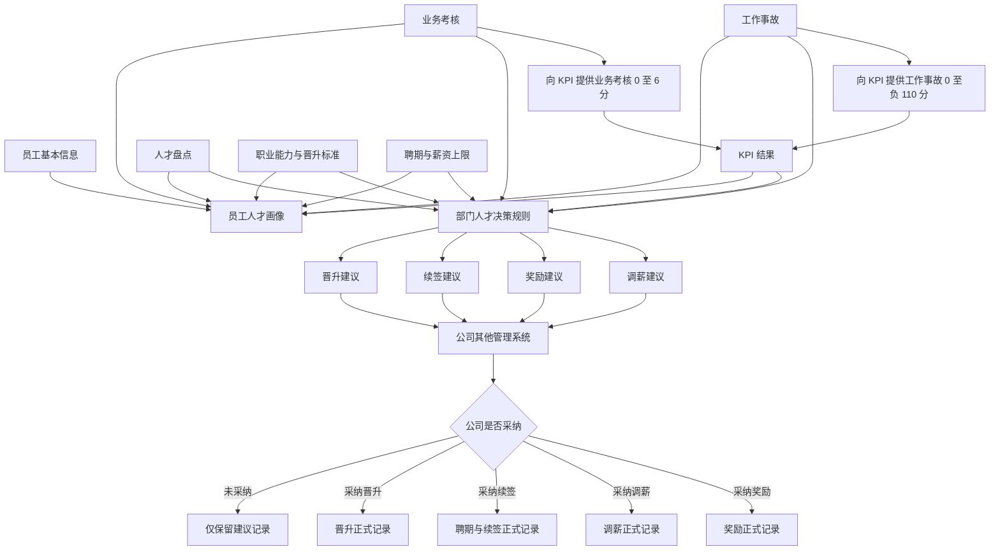

# 人才发展模块设计方案

> 文档状态：设计建议稿  
> 更新日期：2026-08-05  
> 适用项目：产品部管理工作台（depot-KPI）  
> 本文范围：人才画像、人才盘点、职业发展、业务考核、工作事故、部门决策建议，以及晋升、续签、调薪、奖励正式结果管理。

## 1. 背景与目标

当前系统已有人才发展静态原型页，包含人才盘点分布、合同到期、晋升候选、本季奖励和人才画像示例，但尚未接入真实数据和业务流程。

人才发展模块的建设目标是：

- 汇集员工基本信息、KPI、人才盘点、职业能力、业务考核、工作事故、聘期和薪资上限等数据。
- 建立可解释、可追溯的员工人才画像。
- 依据部门绩效管理机制，为晋升、续签、调薪和奖励提供部门内部决策建议。
- 将“部门建议”和“实际发生的正式结果”分开管理。
- 支持查询员工全部晋升、续签、调薪和奖励历史。
- 本系统暂不承接公司正式审批；部门形成初步决策后，继续在公司其他管理系统完成正式流程，并将正式结果登记回本系统。

## 2. 参考资料

### 2.1 业务制度与数据

- 部门绩效管理机制：  
  https://alidocs.dingtalk.com/i/nodes/3xRN9bGQyw4Jb5YggPEBVzXPADKnorv6
- 部门人才发展规划（人员发展规划）：  
  https://alidocs.dingtalk.com/i/nodes/MNDoBb60VLrOEKenFmZ4Oopv8lemrZQ3
- 现行职业发展通道标准及能力模型：  
  https://alidocs.dingtalk.com/i/nodes/AY39rGpMPmeVNxewdA308OZkXKnaoNQ7
- 待优化职业发展通道及能力模型：  
  https://alidocs.dingtalk.com/i/nodes/amweZ92PV6vZkrqotgxyYl1EVxEKBD6p
- 人才盘点历史文件：  
  https://alidocs.dingtalk.com/i/nodes/2Amq4vjg89gq26kxf4MLOQ6ZV3kdP0wQ
- 业务考核文件夹：  
  https://alidocs.dingtalk.com/i/nodes/N7dx2rn0JbZ9j3ewUyZnm56eJMGjLRb3
- 科研数据中台选人组件事故报告：  
  https://alidocs.dingtalk.com/i/nodes/lyQod3RxJK3mEPALIZroP0KBJkb4Mw9r
- 学术主页 UI 问题事故报告：  
  https://alidocs.dingtalk.com/i/nodes/m0Xw6OYE4D7VLOQjgqmyWRq13rbjgPM5

### 2.2 已确认的项目事实

- 当前 `/talent` 页面主要为硬编码静态展示。
- `User` 已包含组织、岗位、入职日期和合同续签日期等部分基础字段。
- `PersonalKpi` 和 `PersonalKpiItem` 已具备个人季度 KPI 及评分数据结构。
- KPI 模板中已经存在“业务考核”和“工作事故”类指标，不需要另建一套 KPI 调整台账。
- 组织权限已支持 `SELF / NODE / SUBTREE / ALL` 数据范围，人才发展模块应复用该体系。
- 当前 Prisma Schema 尚无完整的人才发展业务模型。

## 3. 设计原则

### 3.1 模型独立、决策聚合

- 人才盘点用于评价员工当前状态。
- 职业能力模型用于定义岗位职级和晋升标准。
- 两套模型独立配置、独立计算、独立保存。
- 晋升、续签、调薪和奖励规则在上层同时引用两套模型及其他业务数据。

### 3.2 建议与正式结果分离

- 部门决策建议记录“建议做什么、为什么建议、公司是否采纳”。
- 晋升、续签、调薪、奖励正式结果记录“实际发生了什么”。
- 未被采纳的建议不生成正式结果。
- 公司直接决定或历史导入的正式结果允许没有部门建议来源。

### 3.3 规则和模型版本化

- 人才盘点模型、职业能力模型、晋升标准、事故处罚和人才决策规则均应版本化。
- 模型或规则发布后不可直接修改，只能复制产生新版本。
- 正式盘点和决策保存当时使用的模型、规则和证据快照。

### 3.4 系统建议不等于正式人事决定

- 系统负责计算资格、识别限制、展示证据和形成部门建议。
- 公司正式审批和生效操作由其他管理系统完成。
- 本系统登记正式结果，用于历史查询和后续人才分析。

## 4. 总体业务架构



## 5. 功能模块划分

### 5.1 人才发展工作台

工作台提供部门人才总体概览：

- 人才盘点 S/A/B/C/D 分布。
- 盘点分数和等级趋势。
- 九宫格辅助分析。
- 晋升候选、续签待评估、奖励候选和调薪候选。
- 当前晋升、调薪和奖励限制人数。
- 合同到期预警。
- 关键岗位 B 角覆盖情况。
- 人才数据缺失提醒。

九宫格仅作为辅助视图。在正式映射口径确定前，不参与自动决策。

### 5.2 员工人才画像

员工画像建议包含以下页签：

1. 画像总览。
2. KPI 表现。
3. 人才盘点。
4. 职业发展。
5. 业务考核。
6. 工作事故。
7. 部门决策建议。
8. 晋升正式结果。
9. 聘期与续签正式结果。
10. 调薪正式结果。
11. 奖励正式结果。

画像总览至少展示：

- 当前组织、岗位和具体职级档。
- 入职日期、当前聘期及剩余时间。
- 最近 KPI 分数和等级。
- 最近人才盘点分数和等级。
- 最近业务考核是否及格及 KPI 得分。
- 当前有效的事故及人才决策限制。
- 下一职级条件完成度。
- 当前薪资与职级薪资上限关系。

## 6. 人才盘点模型

### 6.1 业务定位

人才盘点用于评价员工在某一时间点或周期内的当前状态，不直接定义岗位晋升标准。

### 6.2 当前六维模型

| 能力域 | 维度 |
|---|---|
| 价值观 | 忠诚度、工作态度 |
| 发展潜力 | 匹配度、成长度 |
| 能力 | 能力度、产出度 |

评分映射：

| 维度等级 | 分值 |
|---|---:|
| S | 5 |
| A | 4 |
| B | 3 |
| C | 2 |
| D | 1 |

固定统计公式：

```text
总分
= S 级维度数 × 5
+ A 级维度数 × 4
+ B 级维度数 × 3
+ C 级维度数 × 2
+ D 级维度数 × 1
```

总分与等级映射：

| 总分 | 盘点级别 | 含义 |
|---:|---|---|
| 25 至 30 | S | 杰出 |
| 19 至 24 | A | 优秀 |
| 13 至 18 | B | 普通 |
| 7 至 12 | C | 略差 |
| 0 至 6 | D | 淘汰 |

### 6.3 完整性规则

旧 Excel 在六项全部为空时会计算为 0 分、D 级。系统必须区分未完成和 D 级：

```text
必填维度未全部完成：
  totalScore = null
  grade = null
  calculationStatus = INCOMPLETE

必填维度全部完成：
  才计算总分和级别
```

在当前模型中，六个维度均有效填写后的理论最低分为 6 分。

### 6.4 模型配置

人才盘点模型支持配置：

- 模型名称和版本。
- 适用组织、岗位和职级。
- 盘点频率。
- 维度和维度分组。
- 评分选项及分值。
- 必填项和量化证据要求。
- 汇总方式。
- 结果等级和阈值。
- 校准规则。
- 分布提示规则。

当前六维公式作为一个正式模板版本发布和锁定，配置能力不代表每次盘点可随意修改公式。

### 6.5 盘点流程

```text
创建盘点批次
→ 选择人员范围
→ 锁定模型版本
→ 导入或录入维度结果与量化依据
→ 系统计算总分和等级
→ 部门校准
→ 确认
→ 归档
```

不接入轻流。历史数据通过 Excel 或 CSV 导入，后续数据可在系统内维护。

### 6.6 盘点扩展信息

盘点参与人还需要支持：

- 人才类型。
- B 角。
- 任用建议。
- 发展或改进建议。
- 校准前后结果及校准原因。

## 7. 职业发展通道及能力模型

### 7.1 业务定位

职业能力模型用于定义岗位职级、能力要求和晋升标准，不参与人才盘点总分计算。

### 7.2 配置层级

```text
职业通道
└── 岗位序列
    └── 具体岗位
        └── 职级段
            └── 具体职级档
```

示例：

```text
专业通道
└── 产品序列
    └── B 端产品
        ├── R3
        │   ├── R3-1
        │   ├── R3-2
        │   └── R3-3
        └── R4
            ├── R4-1
            ├── R4-2
            └── R4-3
```

职级关系必须通过 `rankOrder` 和 `stepOrder` 等字段管理，禁止通过解析 `R3-2` 字符串判断上下级。

### 7.3 能力模型结构

```text
能力库
→ 能力包
→ 岗位能力模型版本
→ 具体职级档要求
```

能力项分为：

- 公司通用能力。
- 岗位专业能力。
- 管理能力。
- 成果和影响力要求。

一个岗位模型可以组合多个能力包。例如：

```text
C 端产品模型
= 公司通用能力包
+ 产品通用能力包
+ C 端产品专业能力包
```

C 端产品能力模型尚未完成不阻碍开发：岗位可以先建立，模型处于草稿状态，后续配置并发布；未发布模型时不生成晋升能力达标结论。

### 7.4 晋升标准配置

支持以下条件类型：

- 当前职级任职时间。
- KPI 分数或等级。
- 业务考核是否及格。
- 人才盘点分数或等级。
- 项目或需求级别及数量。
- 培训分享次数。
- 带教成果。
- 创新成果。
- 管理与规范建设成果。
- 工作事故限制。
- 人工认定。

规则组支持：

- `ALL`：全部满足。
- `ANY`：任意满足。
- `AT_LEAST_N`：至少满足 N 项。

## 8. 业务考核

### 8.1 业务边界

- 首期支持 Excel 或 CSV 导入。
- 后续允许其他在建系统提供数据源。
- 本系统只保存每名员工、每个科目的最终结果，不记录考试过程和每次考试尝试。
- 业务考核向 KPI 模块提供 0 至 6 分。
- 人才决策使用业务考核综合是否及格。

### 8.2 评分方式

#### 等级评分

配置示例：

```text
要求等级：A
等级顺序：S > A > B > C > D
```

判断规则：

```text
实际等级不低于要求等级 → 及格
实际等级低于要求等级 → 不及格
```

例如要求为 A 时，S、A 及格，B、C、D 不及格。

#### 分数评分

配置示例：

```text
满分：100
及格线：80
```

判断规则：

```text
最终分数 >= 80 → 及格
最终分数 <= 79 → 不及格
```

满分和及格线按科目配置，不在代码中固定。

### 8.3 最终结果类型

```text
INITIAL_PASS   正常考试及格
RETEST_PASS    补考及格
FINAL_FAIL     最终不及格
```

只保存：

- 最终分数或等级。
- 是否及格。
- 最终结果类型。
- 单科 KPI 得分。
- 原始导入值。
- 考核时间、备注和证据链接。

不建立考试尝试明细表。

### 8.4 KPI 计分

业务考核在 KPI 中的总分固定为 6 分。若当季度有 N 个科目：

```text
单科满分 = 6 ÷ N
```

单科计分：

| 最终结果 | 单科 KPI 得分 |
|---|---:|
| 正常考试及格 | 单科满分 |
| 补考及格 | 单科满分 × 50% |
| 最终不及格 | 0 |

三科示例：

```text
PPT 演讲：补考及格 → 1/2
系统演示：正常及格 → 2/2
考试系统：最终不及格 → 0/2
业务考核总分：3/6
```

综合是否及格：

```text
全部科目最终及格 → 综合及格
任意科目最终不及格 → 综合不及格
```

科目数量不能整除 6 时允许小数。计算保留足够精度，结果展示保留两位小数；全部科目正常及格时总分必须校验为 6。

### 8.5 导入

导入需兼容以下原始值：

```text
90
100（补考）
A
A级
A（补考通过）
B级
补考不及格
```

导入流程：

```text
上传文件
→ 选择年度、季度
→ 识别或映射科目
→ 匹配员工
→ 解析分数、等级和补考最终状态
→ 校验是否及格
→ 计算单科和汇总 KPI 得分
→ 展示预检错误
→ 人工确认
→ 正式入库
→ 供 KPI 详情实时查询
```

员工匹配优先级：

```text
员工 ID / 工号
→ 钉钉用户 ID
→ 姓名 + 小组
→ 仅姓名时人工确认
```

## 9. 工作事故

### 9.1 业务边界

- 人才发展模块保存事故事实、等级、责任人、改进措施及人才决策限制。
- 人才发展模块计算季度事故扣分并向 KPI 提供结果。
- KPI 模块使用现有“工作事故”指标项，不新增 KPI 调整台账。
- 人才决策读取事故限制和已经包含事故扣分的最终 KPI，不重复扣分。

### 9.2 事故等级

事故严重程度从高到低：

```text
S > A > B > C > D
```

事故 S 级代表最严重；不得与 KPI、人才盘点的 S 级优秀共用同一枚举或展示语义。

### 9.3 公司处罚规则

| 事故等级 | 公司处罚 |
|---|---|
| S | 解除劳动合同；情节严重者追究法律责任 |
| A | 扣除当年度年终奖；一年内不得晋升、加薪 |
| B | 当季度 KPI 清零；一年内不得晋升、加薪 |
| C | 当季度 KPI 扣 40 分；半年内不得晋升、加薪 |
| D | 当季度 KPI 扣 10 分；取消当季度单项奖和季度奖 |

KPI 中不使用特殊清零指令。B/A/S 级事故统一通过“工作事故”指标项扣满 110 分实现。

### 9.4 KPI 扣分

```text
D 级事故：每次扣 10 分
C 级事故：每次扣 40 分
B/A/S 级事故：工作事故项扣 110 分
```

季度汇总公式：

```text
如果存在任意 B/A/S 级事故：
  deductionScore = 110
否则：
  deductionScore = min(C 级次数 × 40 + D 级次数 × 10, 110)

kpiItemScore = -deductionScore
```

示例：

| 事故情况 | 工作事故 KPI 项得分 |
|---|---:|
| 无事故 | 0 |
| 1 次 D | -10 |
| 1 次 C | -40 |
| 1 次 C + 2 次 D | -60 |
| 任意 B/A/S | -110 |

### 9.5 事故记录内容

事故记录包括：

- 标题和等级。
- 发生、发现和解决时间。
- 问题描述和影响范围。
- 事件经过。
- 直接原因和根本原因。
- 主要、次要及相关责任人。
- 责任说明。
- 临时解决方案。
- 长期改进措施。
- 改进责任人、截止时间和完成情况。
- 复盘结论。
- 原始事故报告链接。

### 9.6 限制规则

事故除影响 KPI 外，还可能限制：

- 晋升。
- 调薪。
- 季度奖励。
- 年终奖励。
- 续签及人才风险判断。

公司规则和部门规则同时命中时，采用更严格且截止时间更晚的限制结果。

## 10. KPI 模块集成

### 10.1 人才发展供 KPI 查询的结果

```text
业务考核项：0 至 6 分
工作事故项：0 至 -110 分
```

人才模块不写入 KPI 分数。KPI 详情根据当前 `PersonalKpi.userId + year + quarter` 直接查询人才模块，向主管展示以下应扣分提醒：

```text
业务考核应扣分 = 业务考核实得分 - 12
工作事故应扣分 = 当前季度有效事故规则计算结果
```

业务考核可能位于“日常工作考核”等综合指标项内，该指标同时还存在周报、分享、投诉、规范等其他扣分。人才提醒只告诉主管其中业务考核应扣多少，主管将其与其他事项合并后填写该指标项总扣分。

```text
其他事项扣分：-3
业务考核提醒：应扣 -6
主管填写指标项总扣分：-9
```

人才模块不修改 `PersonalKpiItem.managerScore`，不新增 KPI 调整台账或计分组成表。

### 10.2 直接查询契约

查询键：

```text
PersonalKpi.userId + PersonalKpi.year + PersonalKpi.quarter
```

查询规则：

- 只读取已确认、未撤销的业务考核和工作事故结果。
- KPI 详情刷新后反映人才模块当前结果。
- 查询过程不得写入或重新计算 KPI 分数。
- 查询失败不影响 KPI 原有评分内容，只显示提醒读取失败。
- 提醒统一显示在 KPI “汇总”行说明区域，不依赖指标名称或模板业务键。

### 10.3 KPI 下钻

业务考核示例：

```text
业务考核：3/6
PPT 演讲：补考及格，2/4
系统演示：正常及格，4/4
考试系统：最终不及格，0/4
```

工作事故示例：

```text
工作事故：-60
C 级 1 次
D 级 2 次
```

### 10.4 KPI 详情扣分提醒

KPI 详情页在表格“汇总”行的左侧说明空白区统一展示只读提醒：

- 业务考核：显示本季度业务考核扣分、科目最终结果摘要及“查看业务考核结果”入口。
- 工作事故：显示事故扣分、已确认事故等级数量、人才决策限制及“查看工作事故”入口。
- 两类提醒分别展示，并注明业务考核扣分应计入“日常工作考核”、事故扣分应计入“工作事故”。
- 无扣分时明确显示“全部及格”或“暂无已确认工作事故”。
- 待确认和查询失败必须显示独立状态，不能伪装为无扣分。
- 提醒明确写明“请与本指标其他扣分合并填写”，避免用户把提醒值当成全部扣分。
- 详情链接遵循人才模块数据权限；没有业务详情权限时只显示扣分数，不返回敏感事实。
- 提醒不占用评分列，不自动填写或修改任何 KPI 指标项。

## 11. 聘期与薪资上限

### 11.1 聘期

不能只依赖 `User.contractRenewAt`。每段聘期应独立保存：

- 第几个聘期。
- 开始和结束日期。
- 续签决定。
- 决定日期。
- 不续签或终止原因。
- 公司外部流程信息。

### 11.2 薪资上限

当前基础配置：

| 职级段 | 薪资上限 |
|---|---:|
| R1 | 10000 |
| R2 | 15000 |
| R3 | 20000 |
| R4 | 30000 |
| R5 | 40000 |
| R6 | 50000 |

具体职级档默认继承职级段上限：

```text
R3-1 / R3-2 / R3-3 → 默认继承 R3 上限 20000
```

后续允许对具体职级档设置覆盖值。具体职级档配置优先于职级段配置。

首期只负责：

- 薪资上限配置。
- 员工当前薪资维护。
- 是否达到职级上限的判断。
- 调薪资格提示。

不负责工资核算。

## 12. 部门决策建议

### 12.1 建议类型

```text
PROMOTION          晋升
CONTRACT_RENEWAL   续签
SALARY_ADJUSTMENT  调薪
REWARD             奖励
```

### 12.2 建议结果

```text
RECOMMEND       建议
NOT_RECOMMEND   不建议
NEED_REVIEW     需要人工复核
```

### 12.3 公司采纳状态

```text
PENDING             待处理
ADOPTED             已采纳
NOT_ADOPTED         未采纳
PARTIALLY_ADOPTED   部分采纳
CANCELLED           已取消
```

一条建议只对应一种决策类型，避免“晋升并调薪”在公司只采纳其中一项时无法独立记录。

建议记录保存：

- 员工和决策类型。
- 部门建议及原因。
- 资格检查结果。
- 命中的规则和证据快照。
- 规则版本。
- 部门评估人员和时间。
- 公司外部流程编号或链接。
- 公司是否采纳及原因。

建议记录不等于正式人事结果。

## 13. 四类人才决策规则

### 13.1 晋升建议

综合使用：

- 目标职级能力与成果条件。
- 当前职级任职时间。
- KPI 结果。
- 人才盘点结果。
- 业务考核是否及格。
- 工作事故限制。

资格判断：

```text
目标职级必选条件全部满足
AND 不存在有效晋升限制
AND 必需证据完整
```

### 13.2 续签建议

综合使用：

- 当前聘期和聘期内晋升情况。
- 人才盘点历史。
- KPI 趋势。
- 业务考核结果。
- 工作事故。
- 人工综合判断。

重点规则包括：

- 三年聘期内是否至少晋升一次。
- 最近三次盘点是否有两次 C。
- 是否连续两次 C。
- 续聘前最近一次盘点是否为 C。
- 是否存在 D 级或更高风险情况。
- 入职一年内盘点不纳入正式聘期考核。

### 13.3 奖励建议

综合使用：

- KPI。
- 人才盘点。
- 业务考核。
- 项目贡献。
- 工作事故奖励限制。
- 奖励池和人工分配。

系统负责资格检查和建议，具体奖励金额或竞币数量由人工确定。

### 13.4 调薪建议

综合使用：

- KPI。
- 人才盘点。
- 业务考核。
- 工作事故限制。
- 当前薪资。
- 当前职级薪资上限。

晋升和调薪不直接挂钩：晋升不一定调薪，调薪不一定晋升。

## 14. 正式结果管理

### 14.1 晋升正式记录

晋升记录保存：

- 员工。
- 来源建议，可为空。
- 原岗位和目标岗位。
- 原职级和目标职级。
- 晋升类型。
- 正式生效日期。
- 原因。
- 公司外部流程编号或链接。
- 登记人和登记时间。

支持：

- 同岗位职级档晋升，例如 R3-1 至 R3-2。
- 跨职级晋升，例如 R3-3 至 R4-1。
- 跨岗位或跨职业通道变化。

正式生效时新增晋升记录，并更新员工当前岗位和职级；历史晋升记录保持不变。

员工全部晋升历史直接查询晋升正式记录，按生效日期倒序展示。

### 14.2 聘期与续签正式记录

每段聘期独立保存，结果支持：

```text
RENEWED       已续签
NOT_RENEWED   不续签
EXTENDED      延期
TERMINATED    终止
```

### 14.3 调薪正式记录

保存：

- 调整前薪资。
- 调整后薪资。
- 调整金额和比例。
- 调整时的职级。
- 正式生效日期。
- 原因和公司外部流程信息。

调薪记录属于敏感数据，需要单独权限。

### 14.4 奖励正式记录

支持：

- 公司季度竞币单项奖。
- 公司年度竞币单项奖。
- 季度项目竞币奖。
- 年终竞币奖。
- 年终现金奖。
- 部门个人竞币奖。
- 部门个人现金奖。

保存奖励类型、标题、金额或竞币数量、奖励周期、日期、原因、关联项目和公司外部流程信息。

### 14.5 正式结果来源

正式结果允许以下来源：

```text
DEPARTMENT_RECOMMENDATION   来源于部门建议
COMPANY_DIRECT              公司直接决定
HISTORY_IMPORT              历史数据导入
MANUAL_ENTRY                人工登记
```

正式结果的 `recommendationId` 可为空。

## 15. 员工人才时间轴

员工详情页聚合正式结果和关键人才事件：

```text
2026-11-01  晋升：R3-1 → R3-2
2026-10-15  奖励：季度个人竞币奖
2026-07-01  调薪：18000 → 19000
2026-06-30  人才盘点：A 级，21 分
2026-04-01  合同续签：第 2 个聘期
2026-03-31  KPI：102 分，A 级
```

时间轴通过聚合各业务表查询形成，不额外建立重复的员工事件总表。

## 16. 建议的数据模型

以下为逻辑模型，具体 Prisma 字段、索引和迁移在实施计划中进一步细化。

### 16.1 职业发展

- `CareerTrack`
- `JobFamily`
- `JobRole`
- `JobLevelGroup`
- `JobLevel`
- `CompetencyItem`
- `CompetencyPackage`
- `CompetencyModelVersion`
- `JobLevelRequirement`
- `PromotionPath`
- `PromotionRuleGroup`
- `PromotionRule`
- `PromotionEvidence`

### 16.2 人才盘点

- `TalentReviewTemplateVersion`
- `TalentReviewDimension`
- `TalentRatingOption`
- `TalentGradeThreshold`
- `TalentReviewCycle`
- `TalentReviewParticipant`
- `TalentReviewDimensionResult`
- `TalentReviewResult`

### 16.3 业务考核

- `BusinessAssessmentCycle`
- `BusinessAssessmentSubject`
- `BusinessAssessmentResult`
- `BusinessAssessmentSummary`

### 16.4 工作事故

- `WorkIncident`
- `WorkIncidentResponsiblePerson`
- `WorkIncidentAction`
- `IncidentRestriction`

### 16.5 聘期与薪资

- `EmploymentContractTerm`
- `SalaryCapConfig`
- `EmployeeCompensationProfile`

### 16.6 建议与正式结果

- `TalentDecisionRecommendation`
- `PromotionRecord`
- `SalaryAdjustmentRecord`
- `RewardRecord`

续签正式结果由 `EmploymentContractTerm` 承载。

### 16.7 审计

- `TalentActionLog`
- 关键模型和决策表保存创建人、修改人、确认人和时间。

## 17. 页面规划

### 17.1 业务页面

- `/talent`：人才发展工作台。
- `/talent/people`：人才画像列表。
- `/talent/people/[userId]`：员工人才画像详情。
- `/talent/reviews`：人才盘点批次与结果。
- `/talent/career`：职业发展与晋升标准。
- `/talent/business-assessments`：业务考核批次、导入和结果。
- `/talent/incidents`：工作事故。
- `/talent/recommendations`：部门决策建议。
- `/talent/promotions`：晋升正式结果。
- `/talent/contracts`：聘期与续签正式结果。
- `/talent/salary-adjustments`：调薪正式结果。
- `/talent/rewards`：奖励正式结果。

### 17.2 配置页面

- 职业通道、岗位序列和职级档。
- 能力库、能力包和岗位能力模型。
- 晋升路径和条件。
- 人才盘点模型。
- 业务考核科目与规则。
- 事故处罚与限制规则。
- 薪资上限。
- 人才决策规则及版本。

## 18. 权限与数据范围

### 18.1 数据范围

复用现有：

```text
SELF
NODE
SUBTREE
ALL
```

### 18.2 建议能力权限

```text
VIEW_TALENT_PROFILE
EDIT_TALENT_PROFILE
VIEW_TALENT_REVIEW
MANAGE_TALENT_REVIEW
CALIBRATE_TALENT_REVIEW
VIEW_CAREER_MODEL
MANAGE_CAREER_MODEL
VIEW_BUSINESS_ASSESSMENT
MANAGE_BUSINESS_ASSESSMENT
VIEW_WORK_INCIDENT
MANAGE_WORK_INCIDENT
VIEW_RECOMMENDATION
MANAGE_RECOMMENDATION
VIEW_PROMOTION_RESULT
MANAGE_PROMOTION_RESULT
VIEW_CONTRACT_RESULT
MANAGE_CONTRACT_RESULT
VIEW_SALARY_RESULT
MANAGE_SALARY_RESULT
VIEW_REWARD_RESULT
MANAGE_REWARD_RESULT
MANAGE_TALENT_CONFIG
```

### 18.3 敏感字段

以下字段需要独立控制：

- 管理者内部评价。
- 人才优化建议。
- 事故责任说明。
- 合同结论。
- 当前薪资。
- 调薪建议及调薪结果。
- 薪资上限。

成员默认只能查看本人的公开画像和正式公开结果，不得查看他人盘点、部门整体人才分布、他人奖励、内部评语和薪资信息。

## 19. 数据导入

首期至少支持：

- 员工聘期及历史晋升数据导入。
- 历史人才盘点数据导入。
- 业务考核数据导入。
- 晋升、续签、调薪和奖励历史结果导入。

通用导入流程：

```text
上传
→ 字段映射
→ 员工匹配
→ 业务校验
→ 预检报告
→ 人工确认
→ 正式写入
→ 回读和统计核对
```

导入必须支持错误行下载，不允许部分静默失败。

## 20. 实施阶段

### 第 0 轮：只读基线与详细设计

- 核对当前 Prisma Schema、KPI 查询和写入链路。
- 核对 KPI 模板中业务考核和工作事故指标的稳定识别方式。
- 输出详细字段、枚举、索引、唯一约束和数据迁移方案。
- 明确首期权限能力和默认授权。

验收门槛：不存在无法落入数据模型的已确认业务规则；不覆盖现有未提交 migration。

### 第 1 轮：人才基础数据与配置底座

- 人才模块权限。
- 员工聘期和具体职级档。
- 职级薪资上限配置。
- 通用模型版本机制。
- 导入基础框架。
- 人才画像真实查询骨架。

验收门槛：数据范围正确，敏感字段不越权；新增配置不影响现有 KPI、年度指标和组织权限。

### 第 2 轮：人才盘点

- 人才盘点模型配置。
- 历史数据导入。
- 盘点批次和人员快照。
- 六维评分、总分和等级。
- B 角、人才类型和任用建议。
- 校准、确认和归档。

验收门槛：未完成数据不会被判定为 D；系统重算与历史有效数据一致；历史版本可回溯。

### 第 3 轮：职业发展

- 职业通道、岗位序列和岗位。
- R3-1/R3-2/R3-3 等具体职级档。
- 能力库、能力包和岗位模型。
- 晋升路径和条件。
- 员工下一职级条件完成度。

验收门槛：新增岗位、职级和能力模型不需要修改代码；草稿模型不参与正式判断。

### 第 4 轮：业务考核与工作事故

- 业务考核批次和科目。
- 分数制、等级制和补考最终结果。
- Excel/CSV 导入。
- 业务考核 0 至 6 分计算与 KPI 详情直接查询。
- 工作事故、责任人和改进措施。
- 工作事故 0 至负 110 分计算与 KPI 详情直接查询。
- 公司和部门限制规则。

验收门槛：KPI 详情按当前员工和季度查询正确；查询不写 KPI；重新导入或修改事故后刷新即可显示最新提醒；KPI 下钻能解释来源。

### 第 5 轮：部门决策建议

- 晋升、续签、调薪和奖励资格检查。
- 部门建议和证据快照。
- 公司流程交接信息。
- 采纳结果登记。

验收门槛：每条建议均能解释命中和未满足规则；建议未采纳时不生成正式结果。

### 第 6 轮：正式结果与历史

- 晋升正式记录。
- 聘期与续签正式记录。
- 调薪正式记录。
- 奖励正式记录。
- 员工历史查询和统一时间轴。
- 历史结果导入。

验收门槛：可以独立查询某位员工全部晋升、聘期、调薪和奖励历史；正式结果不依赖建议记录存在。

## 21. 风险、停止条件与回滚原则

### 21.1 风险

- KPI 汇总行提醒查询失败时需要降级展示，不能影响 KPI 原有评分页面。
- 业务考核历史文件格式不一致，需要预检和人工映射。
- 事故 S 级与其他模块 S 级含义相反，必须使用独立枚举。
- 人才盘点总分和级别不能在维度缺失时生成。
- 薪资、内部评语和事故责任属于敏感信息，需防止列表查询越权。
- 发布后的模型和规则若允许直接修改，会导致历史结论漂移。

### 21.2 停止条件

出现以下情况时停止对应轮次上线：

- 数据权限测试发现越权。
- KPI 详情查询错误员工、年份或季度的人才结果，或查询过程写入 KPI 分数。
- 历史盘点结果无法由已锁定模型复现。
- 正式结果会因员工当前岗位变化而改变历史展示。
- 生产迁移不能保留既有 KPI、组织、权限和年度指标数据。

### 21.3 回滚原则

- 优先采用新增表、新增字段和新增服务，不破坏既有模块。
- 人才发展新页面使用功能开关分阶段启用。
- 配置和业务数据使用逻辑停用或撤销，不普通硬删除。
- 每轮数据库迁移均需提供结构回滚和数据保全方案。
- KPI 人才提醒查询异常时允许关闭提醒功能；关闭不改变任何既有 KPI 指标值。

## 22. 最终需求覆盖检查

| 最初目标 | 方案覆盖 |
|---|---|
| 使用员工基本信息 | 已覆盖 |
| 使用 KPI 数据 | 已覆盖 |
| 使用人才盘点数据 | 已覆盖 |
| 管理员工人才画像 | 已覆盖 |
| 支撑晋升判断 | 已覆盖：职业标准 + KPI + 盘点 + 考核 + 事故 |
| 支撑续签判断 | 已覆盖：聘期 + 晋升历史 + 盘点 + KPI + 风险 |
| 支撑奖励判断 | 已覆盖：KPI + 盘点 + 考核 + 事故 + 贡献 |
| 支撑调薪判断 | 已覆盖：KPI + 盘点 + 考核 + 事故 + 薪资上限 |
| 职业能力模型可配置 | 已覆盖 |
| 人才盘点模型可配置 | 已覆盖 |
| 业务考核导入与 KPI 计分 | 已覆盖 |
| 工作事故管理与 KPI 扣分 | 已覆盖 |
| 建议是否被采纳 | 已覆盖 |
| 晋升正式历史 | 已覆盖 |
| 续签正式历史 | 已覆盖 |
| 调薪正式历史 | 已覆盖 |
| 奖励正式历史 | 已覆盖 |
| 公司正式流程不在本系统审批 | 已明确边界 |

## 23. 结论

本方案已经覆盖人才发展模块的主要业务目标，并明确了以下核心边界：

1. 人才盘点与职业能力模型独立，但人才决策可以同时引用二者。
2. 业务考核和工作事故由人才发展模块管理来源数据和计算结果，并向现有 KPI 指标提供分数。
3. 部门决策建议与晋升、续签、调薪、奖励正式结果分开保存。
4. 正式结果使用独立业务记录，支持完整历史查询，不依赖建议记录反推。
5. 公司正式审批在其他系统完成，本系统负责部门建议、外部流程关联和正式结果登记。
6. 所有模型、规则、计算和正式结果均需可解释、可追溯、可按历史版本还原。

下一步应从第 0 轮开始，进一步输出可直接实施的 Prisma 数据模型、权限能力、服务接口、页面拆分、迁移顺序和逐轮验证清单。
