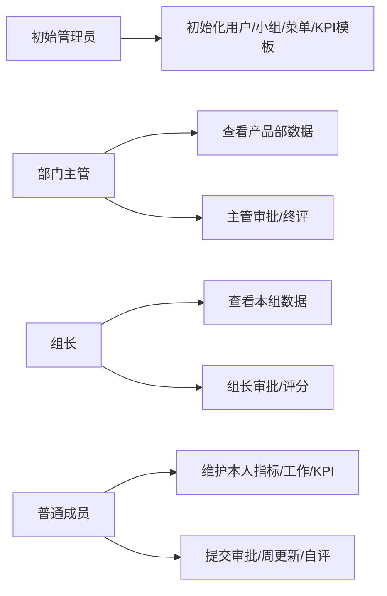
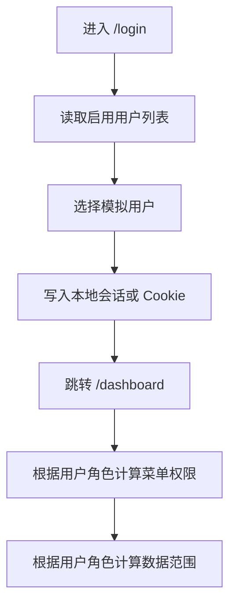
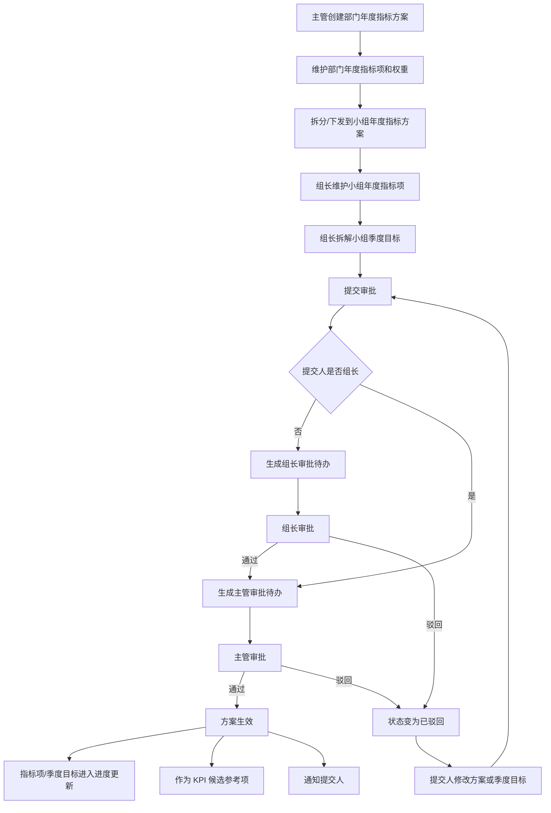
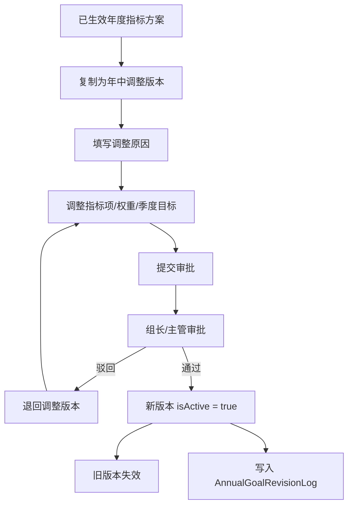
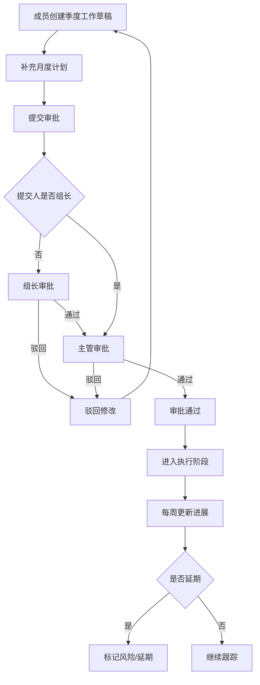
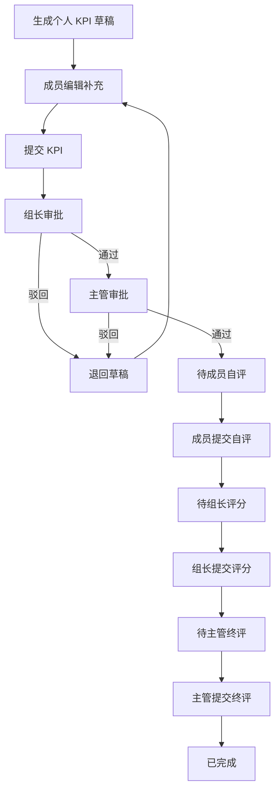
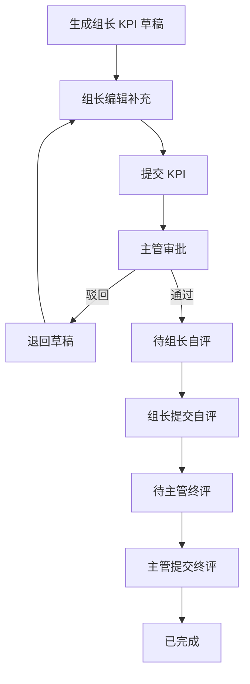
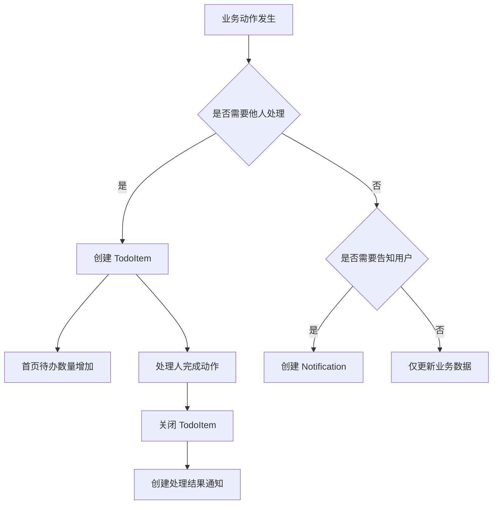

# 部门内部管理网站业务流程图与状态机

## 1. 文档目标

本文补充 MVP 阶段缺失的业务流程图、状态机和流转规则，用于指导后续页面、服务层、审批逻辑、待办通知逻辑开发。

适用范围：

```text
模拟登录
年度指标方案、季度目标拆解与审批
季度工作规划、审批与周更新
KPI 制定、审批、自评与评分
系统内待办与通知
```

MVP 原则：先跑通产品部内部闭环，不接钉钉 OAuth、不做钉钉组织同步、不做复杂定时任务。

## 2. 角色泳道总览



## 3. 模拟登录流程

### 3.1 流程图



### 3.2 规则

| 步骤 | 说明 |
|---|---|
| 用户来源 | 从 `User` 表读取 `isActive = true` 的用户 |
| 身份信息 | 记录 `userId`，后续服务端按 `userId` 查询当前用户 |
| 菜单权限 | 根据 `RoleMenuPermission` 或 MVP 静态规则过滤 |
| 数据权限 | 按 `roleType + departmentId + teamId + id` 计算 |
| 退出登录 | 清除本地会话并回到 `/login` |

## 4. 年度指标方案、季度目标拆解与审批流程

### 4.1 主流程



### 4.2 关键数据变化

| 动作 | 更新对象 | 结果 |
|---|---|---|
| 保存草稿 | `AnnualGoalPlan`、`AnnualGoalMetric`、`AnnualGoalQuarterTarget` | `approvalStatus = DRAFT` |
| 提交 | `AnnualGoalPlan`、`ApprovalInstance`、`ApprovalTask`、`TodoItem` | 进入审批中并生成审批待办 |
| 组长通过 | `ApprovalTask`、`ApprovalInstance`、`AnnualGoalPlan`、`TodoItem` | 关闭组长待办，生成主管待办 |
| 主管通过 | `AnnualGoalPlan`、`ApprovalInstance`、`TodoItem`、`Notification` | `approvalStatus = APPROVED`，写入 `approvedAt` |
| 驳回 | `AnnualGoalPlan`、`ApprovalTask`、`Notification` | `approvalStatus = REJECTED`，通知提交人修改 |
| 周更新 | `AnnualGoalProgress`、`AnnualGoalMetric`、`AnnualGoalQuarterTarget` | 新增进度记录，更新 `currentValue` 和 `riskStatus` |

### 4.3 年中调整流程



| 动作 | 更新对象 | 结果 |
|---|---|---|
| 创建调整版本 | `AnnualGoalPlan`、`AnnualGoalMetric`、`AnnualGoalQuarterTarget` | 新方案 `version` 递增，记录 `revisedFromPlanId` |
| 填写调整原因 | `AnnualGoalPlan` | 写入 `revisionReason` |
| 审批通过 | `AnnualGoalPlan`、`AnnualGoalRevisionLog` | 新版本生效，旧版本 `isActive = false` |

## 5. 季度工作审批与周更新流程

### 5.1 审批流程



### 5.2 周更新规则

| 场景 | 规则 |
|---|---|
| 未开始 | 可更新为 `IN_PROGRESS` 或保持 `NOT_STARTED` |
| 进行中 | 可继续更新进展、下一步计划、风险说明 |
| 已完成 | 可更新为 `COMPLETED` |
| 延期完成 | 若结束时间后完成，标记 `DELAYED_COMPLETED` |
| 风险提醒 | MVP 阶段通过查询状态和截止日期动态展示，不做定时任务 |

## 6. KPI 制定、审批、自评与评分流程

### 6.1 普通成员流程



### 6.2 组长流程



## 7. 待办与通知触发流程



### 7.1 待办触发规则

| 触发动作 | 待办人 | 待办类型 |
|---|---|---|
| 小组年度方案/季度目标提交 | 组长或主管 | 审批待办 |
| 成员提交季度工作 | 组长或主管 | 审批待办 |
| 成员提交 KPI | 组长或主管 | KPI 审批待办 |
| KPI 进入自评 | 被考核人 | KPI 自评待办 |
| KPI 进入组长评分 | 组长 | KPI 评分待办 |
| KPI 进入主管终评 | 主管 | KPI 终评待办 |
| 周更新逾期或风险 | 负责人 | 更新/风险处理待办 |

### 7.2 通知触发规则

| 触发动作 | 通知对象 | 通知内容 |
|---|---|---|
| 审批通过 | 提交人 | 审批已通过 |
| 审批驳回 | 提交人 | 审批被驳回和审批意见 |
| KPI 完成终评 | 被考核人 | KPI 结果已生成 |
| 指标或工作风险 | 负责人、组长、主管 | 风险提醒 |
| 系统初始化 | 管理员 | 初始化结果 |

## 8. ApprovalStatus 状态机

| 当前状态 | 可执行动作 | 操作人 | 下一状态 | 副作用 |
|---|---|---|---|---|
| `DRAFT` | 编辑 | 创建人 | `DRAFT` | 保存业务对象 |
| `DRAFT` | 提交 | 创建人 | `PENDING_LEADER` 或 `PENDING_MANAGER` | 创建审批实例和待办 |
| `PENDING_LEADER` | 通过 | 组长 | `PENDING_MANAGER` | 关闭组长待办，创建主管待办 |
| `PENDING_LEADER` | 驳回 | 组长 | `REJECTED` | 通知提交人 |
| `PENDING_MANAGER` | 通过 | 主管 | `APPROVED` | 关闭待办，写入通过时间 |
| `PENDING_MANAGER` | 驳回 | 主管 | `REJECTED` | 通知提交人 |
| `PENDING_LEADER` / `PENDING_MANAGER` | 撤回 | 提交人 | `WITHDRAWN` | 关闭当前待办 |
| `REJECTED` / `WITHDRAWN` | 修改 | 提交人 | `DRAFT` | 重新进入草稿 |
| `APPROVED` | 无 | - | `APPROVED` | MVP 阶段不允许回退 |

## 9. WorkStatus 状态机

| 当前状态 | 可执行动作 | 操作人 | 下一状态 | 说明 |
|---|---|---|---|---|
| `NOT_STARTED` | 开始执行 | 负责人 | `IN_PROGRESS` | 首次周更新可触发 |
| `NOT_STARTED` | 标记完成 | 负责人 | `COMPLETED` | 适合短周期事项 |
| `IN_PROGRESS` | 更新进展 | 负责人 | `IN_PROGRESS` | 新增 `WeeklyWorkUpdate` |
| `IN_PROGRESS` | 完成 | 负责人 | `COMPLETED` | 正常完成 |
| `IN_PROGRESS` | 延期后完成 | 负责人 | `DELAYED_COMPLETED` | 超过结束日期完成 |
| `COMPLETED` | 查看 | 有权限用户 | `COMPLETED` | 终态 |
| `DELAYED_COMPLETED` | 查看 | 有权限用户 | `DELAYED_COMPLETED` | 终态 |

## 10. RiskStatus 状态机

| 当前状态 | 触发条件 | 下一状态 | 说明 |
|---|---|---|---|
| `NORMAL` | 完成率略低于预期 | `SLIGHT_DELAY` | 黄色提醒 |
| `NORMAL` / `SLIGHT_DELAY` | 明显低于预期或存在风险说明 | `RISK` | 生成风险提醒 |
| `RISK` | 更新后恢复到预期范围 | `NORMAL` | 风险解除 |
| 任意状态 | 完成率达到目标 | `COMPLETED` | 已完成 |

MVP 阶段风险口径可先简化为：

```text
当前完成率 >= 100%：COMPLETED
当前完成率 >= 预期进度：NORMAL
当前完成率 >= 预期进度 - 10%：SLIGHT_DELAY
当前完成率 < 预期进度 - 10%：RISK
```

## 11. KpiStatus 状态机

| 当前状态 | 可执行动作 | 操作人 | 下一状态 | 副作用 |
|---|---|---|---|---|
| `DRAFT` | 编辑 | 被考核人 | `DRAFT` | 保存 KPI 项 |
| `DRAFT` | 提交 | 被考核人 | `PENDING_LEADER` 或 `PENDING_MANAGER` | 创建审批待办 |
| `PENDING_LEADER` | 通过 | 组长 | `PENDING_MANAGER` | 创建主管审批待办 |
| `PENDING_LEADER` | 驳回 | 组长 | `REJECTED` | 通知被考核人 |
| `PENDING_MANAGER` | 通过 | 主管 | `PENDING_SELF_REVIEW` | 创建自评待办 |
| `PENDING_MANAGER` | 驳回 | 主管 | `REJECTED` | 通知被考核人 |
| `REJECTED` | 修改 | 被考核人 | `DRAFT` | 重新提交 |
| `PENDING_SELF_REVIEW` | 提交自评 | 被考核人 | `PENDING_LEADER_SCORE` 或 `PENDING_MANAGER_SCORE` | 创建评分待办 |
| `PENDING_LEADER_SCORE` | 提交评分 | 组长 | `PENDING_MANAGER_SCORE` | 创建主管终评待办 |
| `PENDING_MANAGER_SCORE` | 提交终评 | 主管 | `COMPLETED` | 计算最终分并通知 |
| `COMPLETED` | 查看 | 有权限用户 | `COMPLETED` | 终态 |

## 12. 页面与流程关系

| 页面 | 主要承载流程 |
|---|---|
| `/login` | 模拟登录流程 |
| `/dashboard` | 待办、通知、关键指标聚合展示 |
| `/annual-goals` | 年度指标列表、拆解入口、周更新入口 |
| `/annual-goals/[id]` | 方案详情、指标项、季度目标、审批记录、周更新记录 |
| `/annual-goals/approvals` | 指标审批待办处理 |
| `/quarterly-work` | 季度工作列表、看板、创建入口 |
| `/quarterly-work/[id]` | 月度计划、周更新、审批记录 |
| `/quarterly-work/approvals` | 季度工作审批待办处理 |
| `/kpi` | KPI 当前进度和待办总览 |
| `/kpi/personal` | 本人 KPI 编辑、自评、结果查看 |
| `/kpi/approvals` | KPI 审批、评分、终评处理 |
| `/todos` | 当前用户待办列表和处理入口 |
| `/notifications` | 系统通知列表和已读处理 |

## 13. 开发落地建议

后续服务层建议围绕以下能力拆分：

```text
src/server/auth/mock-session.ts
src/server/permissions/data-scope.ts
src/server/permissions/action-permission.ts
src/server/workflows/approval-service.ts
src/server/workflows/annual-goal-workflow.ts
src/server/workflows/quarterly-work-workflow.ts
src/server/workflows/kpi-workflow.ts
src/server/notifications/todo-service.ts
src/server/notifications/notification-service.ts
```

第一批开发只需要实现：

```text
模拟登录
当前用户读取
菜单与数据范围展示
Dashboard 基础统计
Todo/Notification 查询
```

其中模拟登录按原型文档的居中账号确认页实现：白色登录卡片、头像/姓名、立即登录按钮、返回用户选择列表。页面色彩使用 RJ 色板，主按钮使用 #3069F9。

暂不实现完整审批提交和 KPI 评分，避免第一轮功能切片过大。
