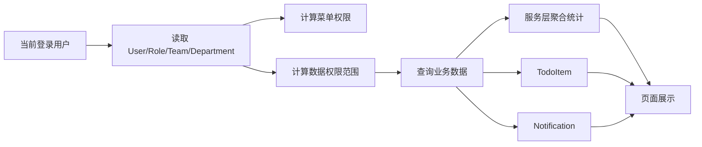
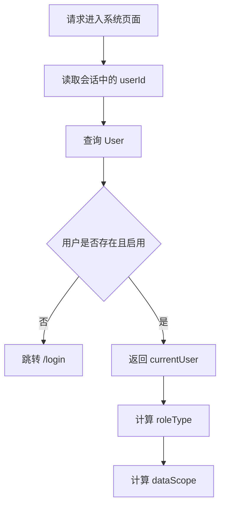
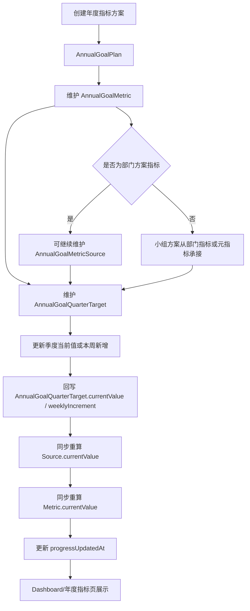
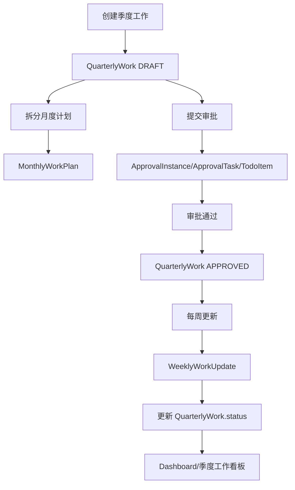
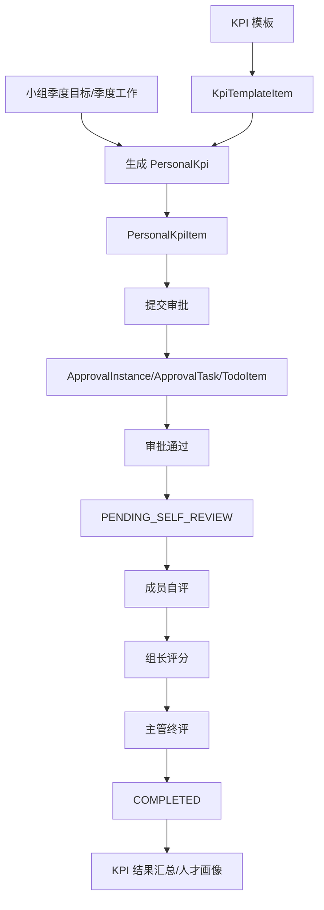
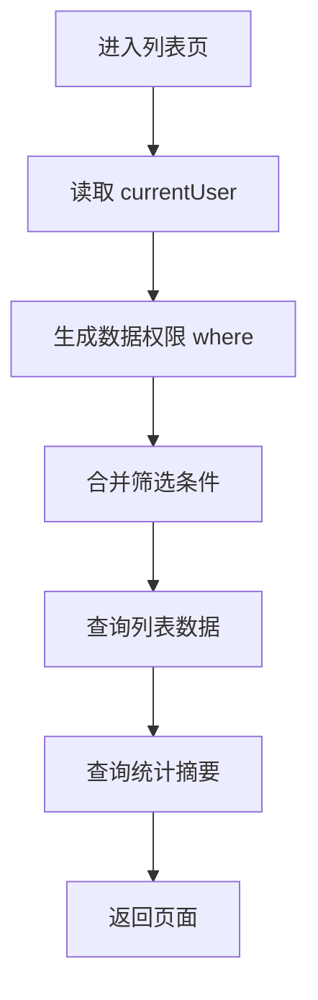

# 部门内部管理网站数据流与统计口径说明

## 1. 文档目标

本文补充 MVP 阶段的数据流、权限过滤规则和统计口径，用于指导首页工作台、列表页、审批待办、通知中心和后续服务层开发。

重点解决：

```text
数据从哪里来
按什么权限过滤
页面展示什么口径
统计字段如何计算
哪些统计先做动态查询
哪些暂不做复杂自动化
```

## 2. 总体数据流



### 2.1 分层建议

```text
页面组件
  ↓
server query/action
  ↓
权限过滤服务
  ↓
业务服务
  ↓
Prisma 数据访问
  ↓
SQLite / 后续 PostgreSQL
```

MVP 阶段页面不要直接拼复杂权限条件，建议统一由服务层生成查询条件。

## 3. 当前用户数据流



### 3.1 currentUser 字段

页面和服务层最少需要：

| 字段 | 用途 |
|---|---|
| `id` | 判断本人数据 |
| `name` | 页面欢迎语 |
| `roleType` | 菜单、操作、数据权限 |
| `departmentId` | 部门范围过滤 |
| `teamId` | 小组范围过滤 |
| `title` | 展示岗位 |
| `isActive` | 判断是否允许登录 |

## 4. 数据权限过滤口径

### 4.1 通用规则

| 角色 | 数据范围 | 查询口径 |
|---|---|---|
| `ADMIN` | 全部数据 | 不加组织过滤 |
| `DEPARTMENT_MANAGER` | 本部门数据 | `departmentId = currentUser.departmentId` |
| `TEAM_LEADER` | 本组数据 | `teamId = currentUser.teamId` |
| `MEMBER` | 本人数据 | `ownerId/userId/updaterId = currentUser.id` |

### 4.2 不同业务对象的本人字段

| 业务对象 | 本人字段 |
|---|---|
| `AnnualGoalPlan` | `createdById` 或按 `departmentId/teamId` 过滤 |
| `AnnualGoalMetric` | 通过 `planId` 关联方案范围 |
| `AnnualGoalQuarterTarget` | 通过 `metricId -> planId` 关联方案范围 |
| `AnnualGoalProgress` | `updaterId` |
| `QuarterlyWork` | `ownerId` |
| `WeeklyWorkUpdate` | `updaterId` |
| `RequirementValueTrack` | `ownerId` |
| `PersonalKpi` | `userId` |
| `Notification` | `userId` |
| `TodoItem` | `userId` |

### 4.3 服务层建议输出

权限服务建议提供：

```text
getCurrentUser()
getDataScope(currentUser)
getUserWhereByScope(currentUser)
getAnnualGoalWhereByScope(currentUser)
getQuarterlyWorkWhereByScope(currentUser)
getKpiWhereByScope(currentUser)
getTalentWhereByScope(currentUser)
canPerformAction(currentUser, action, target)
```

## 5. Dashboard 数据流

```mermaid
flowchart TD
  A[/dashboard] --> B[读取 currentUser]
  B --> C[计算 dataScope]
  C --> D[查询年度指标]
  C --> E[查询季度工作]
  C --> F[查询 KPI]
  C --> G[查询 TodoItem]
  C --> H[查询 Notification]
  D --> I[年度指标完成率]
  E --> J[季度工作完成情况]
  F --> K[KPI 当前进度]
  G --> L[待我审批/待处理]
  H --> M[最近通知/风险提醒]
  I --> N[Dashboard 展示]
  J --> N
  K --> N
  L --> N
  M --> N
```

## 6. Dashboard 统计口径

### 6.1 年度指标完成率

数据来源：

```text
AnnualGoalPlan
AnnualGoalMetric
AnnualGoalMetricSource
AnnualGoalQuarterTarget
```

MVP 当前实现口径：

```text
单个指标项完成率 = currentValue / targetValue * 100
方案完成率 = sum(指标项完成率 * weight) / sum(weight)
年度指标总览完成率 = 当前范围内部门方案指标项的加权完成率
```

当前实现说明：

```text
Dashboard 与年度指标页主要使用 AnnualGoalMetric.currentValue / targetValue 计算展示完成率
如果指标项下没有直接季度目标，但存在元指标，则指标项 currentValue 汇总自各元指标 currentValue
小组方案更多用于部门拆解与视图展示，当前不直接并入部门整体 overallWeightedProgress
```

限制：

```text
deletedAt 不为空的数据不统计
AnnualGoalMetric.targetValue = 0 的指标项不参与完成率计算
当前并不是只统计 approvalStatus = APPROVED 的方案；审批状态字段已存在，但未形成完整统计闭环
```

后续可扩展：

```text
按部门/小组层级分别计算
补充不同 calculationType 的差异化完成度算法
补充预期进度/自动风险判定口径
```

### 6.2 待我审批

数据来源：

```text
TodoItem
ApprovalTask
```

MVP 优先口径：

```text
TodoItem.userId = currentUser.id
TodoItem.isDone = false
TodoItem.targetType 属于审批类
```

审批类 `targetType` 建议：

```text
ANNUAL_GOAL_APPROVAL
QUARTERLY_WORK_APPROVAL
KPI_APPROVAL
KPI_SCORE
```

如果后续需要更严谨，可从 `ApprovalTask` 反查：

```text
ApprovalTask.approverId = currentUser.id
ApprovalTask.status in PENDING_LEADER / PENDING_MANAGER
```

### 6.3 本周待更新

数据来源：

```text
AnnualGoalMetric
AnnualGoalMetricSource
AnnualGoalQuarterTarget
QuarterlyWork
WeeklyWorkUpdate
TodoItem
```

MVP 简化口径：

```text
优先统计未完成 TodoItem 中 targetType 为 GOAL_UPDATE 或 WORK_UPDATE 的数量
```

当前年度指标实现说明：

```text
年度指标周更新当前主要直接更新“当前季度”的 AnnualGoalQuarterTarget.weeklyIncrement 与 currentValue
更新后同步回写上层元指标/指标项 currentValue，并刷新 progressUpdatedAt
当前未以 AnnualGoalProgress 作为页面主统计来源
```

后续增强口径：

```text
本周没有季度目标更新记录的本人负责指标项或元指标
本周没有 WeeklyWorkUpdate 的本人季度工作
且业务对象未完成
```

### 6.4 风险预警

数据来源：

```text
AnnualGoalMetric.riskStatus
AnnualGoalQuarterTarget.riskStatus
QuarterlyWork.status/endDate
Notification.type
```

MVP 口径：

```text
年度指标：riskStatus = RISK 或 SLIGHT_DELAY
季度工作：status != COMPLETED 且 endDate < 当前日期
通知：Notification.type = TALENT_WARNING 或 WORK_DELAY 且未读
```

Dashboard 风险预警数量：

```text
风险指标数 + 延期工作数 + 未读风险通知数
```

### 6.5 季度工作完成情况

数据来源：

```text
QuarterlyWork
WeeklyWorkUpdate
```

MVP 口径：

```text
季度工作总数 = 当前数据范围内 QuarterlyWork 数量
已完成数 = status in COMPLETED / DELAYED_COMPLETED
完成率 = 已完成数 / 季度工作总数 * 100
```

状态分布：

```text
NOT_STARTED
IN_PROGRESS
COMPLETED
DELAYED_COMPLETED
```

### 6.6 KPI 当前进度

数据来源：

```text
PersonalKpi
PersonalKpiItem
TodoItem
```

MVP 口径：

```text
按 PersonalKpi.status 分组计数
```

展示项：

| 指标 | 口径 |
|---|---|
| 已生成 KPI 人数 | `PersonalKpi` 总数 |
| 待审批人数 | `status in PENDING_LEADER, PENDING_MANAGER` |
| 待自评人数 | `status = PENDING_SELF_REVIEW` |
| 待评分人数 | `status in PENDING_LEADER_SCORE, PENDING_MANAGER_SCORE` |
| 已完成评分人数 | `status = COMPLETED` |

## 7. 年度指标数据流



### 7.1 指标完成值口径

```text
AnnualGoalQuarterTarget.currentValue 是季度进度更新的直接落点
AnnualGoalQuarterTarget.weeklyIncrement 记录当前季度的本周新增值
若更新的是元指标季度目标，则先汇总到对应 AnnualGoalMetricSource.currentValue
指标项若直接维护季度目标，则 AnnualGoalMetric.currentValue 取其季度当前值汇总
指标项若没有直接季度目标但存在元指标，则 AnnualGoalMetric.currentValue 汇总自各元指标 currentValue
```

如果没有进度记录：

```text
currentValue 默认 0
```

### 7.2 预期进度口径

当前实现说明：

```text
当前年度指标模块尚未形成正式的“预期进度”核心计算口径
页面当前重点展示实际完成率、风险状态、更新时间与加权汇总结果
riskStatus 当前主要依赖人工维护，不由预期进度自动推导
```

后续如需补齐，可考虑：

```text
按季度拆解结果计算阶段预期进度
按不同 calculationType 配置差异化预期算法
结合实际完成率与时间进度自动判定风险状态
```

## 8. 季度工作数据流



### 8.1 工作状态口径

```text
QuarterlyWork.status 是列表和看板主状态
WeeklyWorkUpdate.status 是每次周更新时的状态快照
```

页面展示时：

```text
当前状态取 QuarterlyWork.status
最近更新取最新一条 WeeklyWorkUpdate
```

## 9. KPI 数据流



### 9.1 KPI 与年度指标关系

季度 KPI 可参考小组季度目标和季度工作，但不与年度指标项或季度目标强绑定。

### 9.2 KPI 最终分口径

MVP 简化：

```text
PersonalKpiItem.finalScore = 主管终评分数
PersonalKpi.finalScore = sum(PersonalKpiItem.finalScore * weight) / sum(weight)
```

限制：

```text
weight 必须大于 0
未评分项不参与完成态
只有主管终评后才能进入 COMPLETED
```

## 10. 通知与待办数据流

```mermaid
flowchart TD
  A[提交/审批/评分/风险动作] --> B{是否需要处理}
  B -- 是 --> C[创建 TodoItem]
  B -- 否 --> D[创建 Notification]
  C --> E[Dashboard 待办]
  C --> F[/todos]
  D --> G[Dashboard 通知]
  D --> H[/notifications]
  F --> I[用户处理]
  I --> J[TodoItem.isDone = true]
  J --> K[必要时创建 Notification]
```

### 10.1 TodoItem 口径

| 字段 | 说明 |
|---|---|
| `userId` | 待处理人 |
| `title` | 待办标题 |
| `targetType` | 业务对象类型或动作类型 |
| `targetId` | 业务对象 ID |
| `isDone` | 是否完成 |
| `dueDate` | 截止时间，可为空 |

待办数量：

```text
TodoItem.userId = currentUser.id
TodoItem.isDone = false
```

### 10.2 Notification 口径

未读通知数量：

```text
Notification.userId = currentUser.id
Notification.isRead = false
```

最近通知：

```text
按 createdAt 倒序取最新 5 条
```

## 11. 列表页通用数据流



### 11.1 通用列表规则

| 项 | MVP 规则 |
|---|---|
| 默认排序 | `updatedAt desc` 或业务时间倒序 |
| 分页 | 首期可每页 20 条 |
| 搜索 | 先支持关键词模糊搜索核心名称字段 |
| 筛选 | 按状态、年份/季度、小组、负责人 |
| 软删除 | `deletedAt = null` |
| 空状态 | 展示引导文案和主操作入口 |

## 12. 首页第一批实现建议

为了配合第一个功能切片，Dashboard 第一版只实现以下真实数据：

```text
当前用户欢迎信息
当前角色
当前数据范围说明
用户数量
小组数量
未完成待办数量
未读通知数量
KPI 状态数量
季度工作状态数量
年度指标加权完成率
```

暂时可以不做：

```text
复杂图表
同比环比
高级 BI
自定义看板
钉钉提醒
定时任务
```

## 13. 待确认统计口径

以下口径后续需要业务确认，MVP 可先使用简化版：

| 项 | 当前 MVP 口径 | 待确认点 |
|---|---|---|
| 年度指标完成率 | 按指标项权重加权 | 小组方案是否长期不并入总体完成率，后续是否需要单独统计 |
| 预期进度 | 当前未形成统一自动口径 | 是否需要按季度拆解或计划曲线补充 |
| 风险阈值 | 当前以人工维护 riskStatus 为主 | 是否需要按完成率/时间进度自动判定 |
| KPI 最终分 | 主管终评分加权 | 是否需要等级换算 |
| 待更新事项 | TodoItem 优先 | 是否按自然周自动生成 |
| 人才预警 | 手动/动态查询 | 是否需要定时提醒 |

## 14. 开发落地建议

建议后续先实现这些服务：

```text
src/server/auth/current-user.ts
src/server/permissions/data-scope.ts
src/server/dashboard/dashboard-query.ts
src/server/todos/todo-query.ts
src/server/notifications/notification-query.ts
```

Dashboard 查询建议聚合为一个入口：

```text
getDashboardData(currentUser)
```

返回结构建议：

```text
{
  currentUser,
  dataScopeLabel,
  summaryCards,
  todoPreview,
  notificationPreview,
  riskPreview,
  kpiProgress,
  quarterlyWorkStats,
  annualGoalStats
}
```

这样页面只负责展示，统计口径集中在服务层，后续调整时不需要大改 UI。
